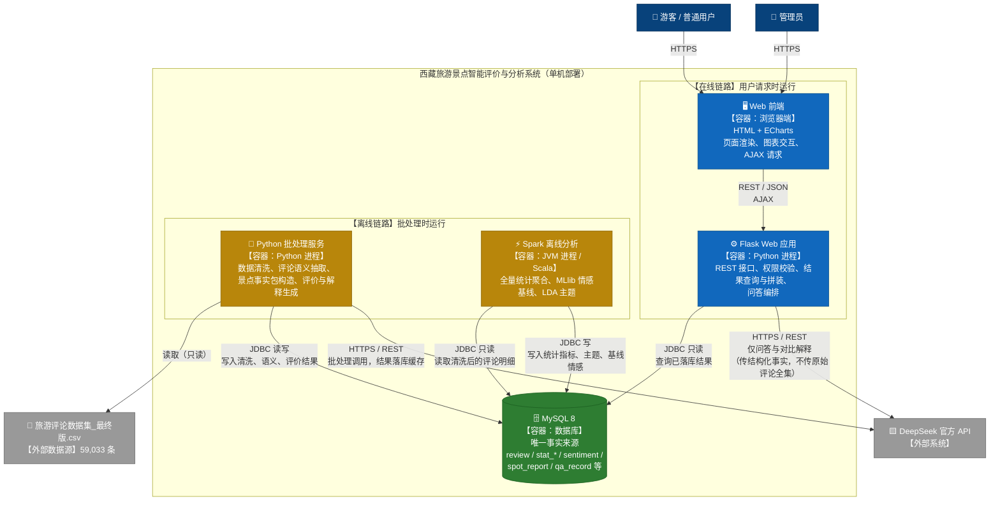

# C4 L2 · 容器图（Container Diagram）

**项目名称**：基于 DeepSeek 的西藏旅游景点智能评价与分析系统
**文档版本**：V1.0
**编制日期**：2026-09-20
**上游依据**：`docs/architecture/C4系统上下文图.md`、`开题/业务需求文档.md`（V1.1）

---

## 1. 容器图



---

## 2. 容器清单与职责

| # | 容器 | 技术 | 运行形态 | 职责 | 对应需求 |
|---|---|---|---|---|---|
| 1 | **Web 前端** | HTML + ECharts + axios | 浏览器 | 页面渲染、图表展示、数据口径标注、表单与交互、调用后端接口 | FR-OV-*、FR-SA-*、FR-IE-*、FR-CP-*、FR-QA-*、NR-U-* |
| 2 | **Flask Web 应用** | Python + Flask + PyMySQL | 常驻进程 | 提供 REST 接口；登录与权限校验；查询并拼装已落库结果；**编排智能问答与对比解释**（检索事实 → 调 DeepSeek → 返回并存记录） | M1–M6 全部在线功能 |
| 3 | **Python 批处理服务** | Python（pandas、jieba、requests） | 按需执行的脚本 | ① 数据清洗与规范化；② 评论语义批量抽取；③ 景点事实包构造；④ 景点评价与对比解读的批量预生成；⑤ 任务日志写入 | FR-OV-01、M2 统计来源、M3、NR-R-01 |
| 4 | **Spark 离线分析** | Scala 2.13.10 + Spark 3.3.1（Spark SQL、MLlib） | JVM 批作业（`local[*]`） | ① 全量多维统计聚合；② MLlib 情感基线模型训练与批量推理；③ LDA 主题发现；④ 结果写库 | M1 指标、FR-SA-02/04/06、NR-P-06 |
| 5 | **MySQL 8** | MySQL 8 @ localhost:3306 | 常驻服务 | **唯一事实来源**：存储清洗后明细、统计指标、语义结果、主题、事实包、评价报告、对比与问答记录、用户与任务日志 | 全部数据需求 |
| 6 | **DeepSeek 官方 API** | 外部 HTTPS 服务 | 外部 | 评论语义理解、景点评价生成、对比解读、问答回答 | M3、M4、M5 |
| 7 | **最终数据集** | CSV（UTF-8 with BOM） | 静态文件 | 清洗与分析的唯一输入 | §3.1 |

---

## 3. 容器间通信

| 源 → 目标 | 协议 | 传输内容 | 频率 |
|---|---|---|---|
| 前端 → Flask | HTTP/REST + JSON（AJAX） | 查询参数、登录信息、用户提问 | 用户请求时 |
| Flask → MySQL | JDBC（PyMySQL），**只读** | SELECT 查询 | 每次请求 |
| Flask → DeepSeek | HTTPS/REST | **仅**问答与对比解释所需的结构化事实片段 | 用户提问／对比时 |
| Python 批处理 → CSV | 文件读取（只读） | 59,033 行原始数据 | 清洗时一次 |
| Python 批处理 → MySQL | JDBC | 批量写入（含幂等 upsert） | 分批执行 |
| Python 批处理 → DeepSeek | HTTPS/REST | 批处理请求（Prompt + 评论或事实包） | 离线批量，限并发 |
| Spark → MySQL | JDBC | 读评论明细；写统计指标、主题、基线情感 | 作业运行时 |
| Spark → DeepSeek | — | **不调用**（Spark 不接触大模型） | — |

> **关键约束**：Spark 容器**不与 DeepSeek 交互**，Flask 容器**不触发批处理**（避免在线请求引发长时间作业）。二者通过 MySQL 解耦。

---

## 4. 为什么这样划分容器（设计理由）

### 4.1 为什么"离线链路"与"在线链路"必须分开

| 维度 | 在线链路 | 离线链路 |
|---|---|---|
| 触发方式 | 用户点击 | 手动／脚本执行 |
| 单次耗时 | 毫秒–秒级（NR-P-01 ≤3 秒、NR-P-02 ≤2 秒） | 分钟–小时级（NR-P-05 ≤10 分钟、NR-P-06 ≤30 分钟） |
| 是否调用大模型 | **仅问答与对比解释**（≤20 秒，NR-P-04） | 是（批量，可分批） |
| 失败影响 | 用户可见，需明确提示 | 不影响在线可用性，可重跑 |
| 幂等要求 | 不高 | **必须**（NR-R-01／02，断点续跑与不重复计费） |

若将批处理逻辑放进 Web 请求中，将同时违反 NR-P-01（响应时间）、CC-1／CC-2（成本）与 NR-R-05（可用性），因此**物理分离**是最直接的保障。

### 4.2 为什么 Python 与 Spark 两个容器并存，而不是合并

| 容器 | 擅长 | 本项目中承担 |
|---|---|---|
| Spark（Scala） | 全量数据的分布式聚合与机器学习 | 59,033 条的多维统计、MLlib 情感基线、LDA 主题 |
| Python | 行级处理与外部 HTTP 集成 | 字段级清洗、文本预处理、DeepSeek API 调用与断点续跑 |

**二者职责不重叠**：Spark 不发起 HTTP 调用，Python 不做大规模聚合与模型训练。数据通过 MySQL 传递，避免在进程间直接耦合，任一环节可单独重跑。

> **对照答辩问题"既然 Spark MLlib 能做情感分析，为什么还需要 DeepSeek？"**：MLlib 以星级为弱标签，输出的是整体极性分类（回答"整体情感如何"）；DeepSeek 输出的是细粒度语义（情感极性＋强度＋**所针对的评价方面**＋关键词＋摘要），回答"评论具体在说什么、游客到底在乎什么"。本项目中 MLlib 的角色是**基线与对照实验**（FR-SA-04），DeepSeek 是**主方法与解释生成器**，两者是基线与增强关系，不是替代关系。

### 4.3 为什么 Flask 只读数据库

| 理由 | 说明 |
|---|---|
| 性能 | 已落库结果直接查询，满足 NR-P-02（≤2 秒） |
| 成本 | 生成类结果不重复调用模型（CC-2），避免同一景点评价被反复计费 |
| 可用性 | DeepSeek 不可用时，已有结果仍可正常展示（NR-R-05） |
| 一致性 | 页面展示的评价与"评价所依据的关键数据"来自同一次事实包快照，可核对（FR-IE-06） |

**例外**：智能问答与景点对比解读**必须在请求时调用** DeepSeek（内容是针对当次提问组合生成的），因此这两个流程在 Flask 内编排，但**只传结构化事实片段**（CC-3），不传原始评论全集。

---

## 5. 部署视图（单机）

```
Windows 单机
├── MySQL 8 服务                    localhost:3306
├── Flask Web 应用（Python 3.11）    常驻进程，监听本地端口
├── 浏览器（访问 Web 前端）
└── 批处理（按需手动/脚本触发）
    ├── python clean/parse/llm_*.py      数据清洗与语义抽取
    └── spark-submit --master local[*]   Spark 离线分析（JDK 1.8）
```

| 部署约束 | 说明 |
|---|---|
| 进程数 | 在线 2 个（MySQL、Flask）；批处理进程按需启动，运行结束即退出 |
| 不使用容器化 | 不引入 Docker／K8s（技术栈红线） |
| 不设反向代理与集群 | 单机演示即可满足 NR-C-04（10–20 并发） |
| 定时任务 | **不使用**调度框架；批处理由管理员手动触发（FR-SY-03），避免引入额外组件 |

---

**文档结束**
