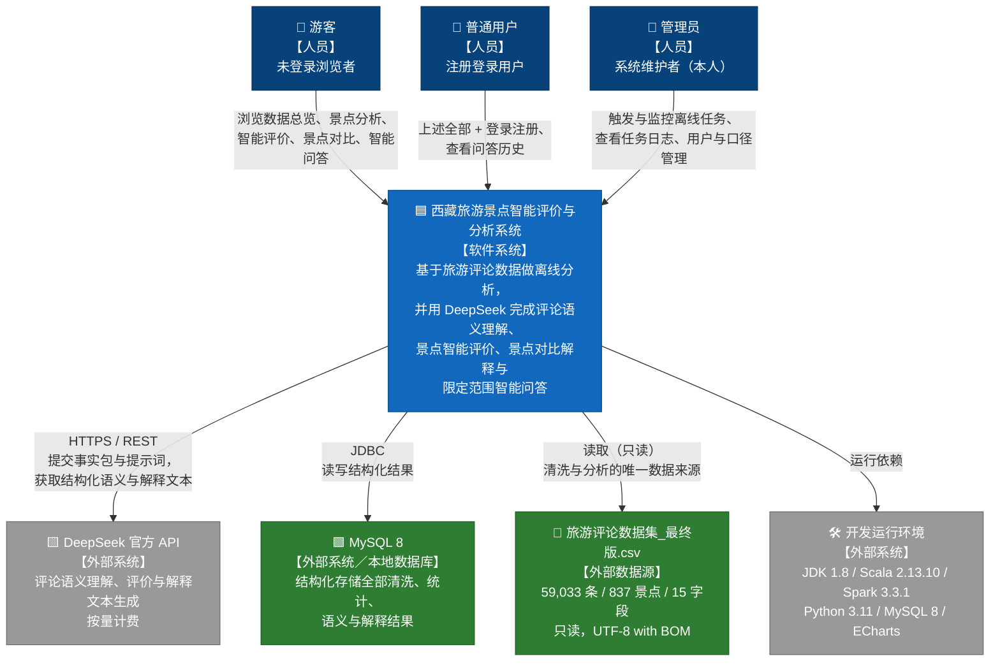

# C4 L1 · 系统上下文图（System Context Diagram）

**项目名称**：基于 DeepSeek 的西藏旅游景点智能评价与分析系统
**文档版本**：V1.0
**编制日期**：2026-09-20
**上游依据**：`开题/业务需求文档.md`（V1.1）、`docs/architecture/C4架构视图.md`

---

## 1. 上下文图

---

## 2. 参与者与外部系统说明

### 2.1 人员（Actors）

| 参与者 | 类型 | 与本系统的交互 | 对应需求 |
|---|---|---|---|
| **游客** | 未登录浏览者 | 只读浏览：数据总览、景点分析、景点智能评价、景点对比、智能问答；**不保存问答历史** | FR-OV-*、FR-SA-*、FR-IE-*、FR-CP-*、FR-QA-01～07 |
| **普通用户** | 注册登录用户 | 游客全部能力 ＋ **问答历史记录**查看 | 上述 ＋ FR-QA-08、FR-SY-01、FR-SY-02 |
| **管理员** | 系统维护者（本人） | **后台管理**：触发／监控离线任务、查看任务日志、用户管理、数据口径配置 | FR-SY-03～05 |

> **权限模型说明（从简）**：仅区分上述三类，不做复杂 RBAC、不做细粒度数据权限、不做单点登录。管理员权限与普通用户权限**并列**，非继承关系。

### 2.2 外部系统（External Systems）

| 外部系统 | 与系统的关系 | 交互内容 | 关键约束 |
|---|---|---|---|
| **DeepSeek 官方 API** | 系统调用（出站） | ① 评论语义理解（情感／强度／方面／关键词／摘要）；② 景点智能评价生成；③ 景点对比解读；④ 智能问答自然语言回答 | **按量计费**，须遵守成本控制方案（CC-1～CC-4）；**API Key 仅存服务端**（NR-S-04）；不可用时系统须正常展示已有结果（NR-R-05） |
| **MySQL 8** | 系统依赖（本地） | 存储与查询全部结构化结果；是"事实"的唯一权威来源 | `localhost:3306`；单库；utf8mb4；不引入分布式存储 |
| **旅游评论数据集_最终版.csv** | 系统读取（入站，只读） | 清洗与分析的**唯一**数据来源 | 59,033 条；只读，不覆盖（BR-11）；UTF-8 with BOM；读入须校验行数 |
| **开发运行环境** | 系统运行依赖 | JDK 1.8、Scala 2.13.10、Spark 3.3.1、Python 3.11.7、MySQL 8、ECharts | 单机 `local[*]`；Windows；无 GPU |

### 2.3 明确不在上下文内的外部系统

以下系统**不出现**在上下文图中，因为本课题明确不与之交互：

| 排除项 | 原因 |
|---|---|
| 携程／其他旅游平台接口 | 数据采集阶段已完成，本系统**不重采、不重爬** |
| 天气、地图、酒店、票务、支付类服务 | 与核心评论数据关系弱，属范围外事项 |
| 向量数据库／检索引擎 | 智能问答采用结构化检索，无需向量检索（ADR-3） |
| 消息队列／流计算平台 | 无实时数据源（技术栈红线） |
| 第三方登录（微信／QQ 等） | 权限模型从简，不做单点登录 |

---

## 3. 系统边界

**系统内**（由本课题实现）：

- 对已完成数据集的离线清洗、规范化与入库；
- Spark 离线统计、MLlib 情感基线与 LDA 主题分析；
- DeepSeek 评论语义理解批处理；
- 景点事实包构造与景点智能评价生成；
- 景点结构化对比与对比解释生成；
- 限定在评论数据范围内的智能问答；
- Flask REST 接口与 ECharts 前端展示；
- 用户注册登录与管理员后台。

**系统外**（不实现）：数据采集、实时流处理、个性化推荐、路线／天气／酒店／票务、移动端、多平台对比、客流预测、虚假评论识别、图像内容分析、数据导出。

---

**文档结束**
