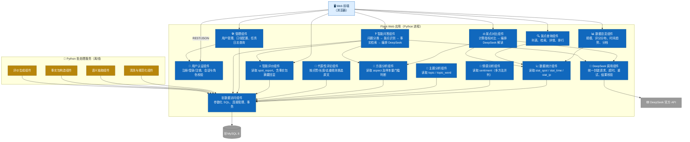
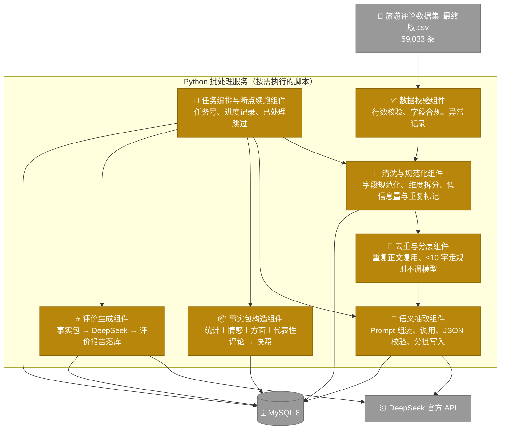
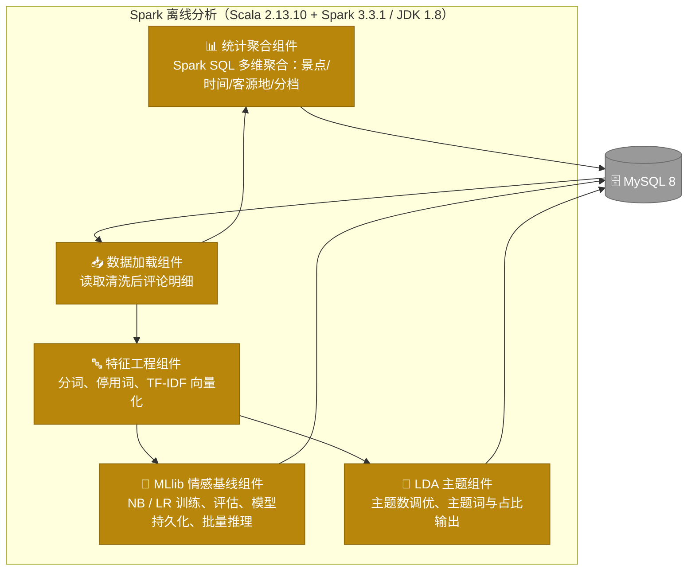

# C4 L3 · 组件图（Component Diagram）

**项目名称**：基于 DeepSeek 的西藏旅游景点智能评价与分析系统
**文档版本**：V1.0
**编制日期**：2026-09-20
**上游依据**：`docs/architecture/C4容器图.md`、`开题/业务需求文档.md`（V1.1）

本文档对三个**自研容器**做组件级拆分：Flask Web 应用、Python 批处理服务、Spark 离线分析。
MySQL 与 DeepSeek API 为外部系统，不作为容器拆分对象（其结构见 `docs/database/`）。

---

## 1. Flask Web 应用组件图

### 1.1 组件职责与接口

| # | 组件 | 职责 | 主要接口（REST） | 依赖 | 对应需求 |
|---|---|---|---|---|---|
| 1 | **用户认证组件** | 注册、登录、注销、会话与角色校验；密码加密存储 | `POST /api/auth/register`、`POST /api/auth/login`、`POST /api/auth/logout`、`GET /api/auth/me` | 数据访问 | FR-SY-01、FR-SY-02、NR-S-01/02 |
| 2 | **数据总览组件** | 汇总数据集规模、评分分布、时间趋势、评论量分档、来源口径构成 | `GET /api/overview/summary` | 数据统计 | FR-OV-01～05、08 |
| 3 | **景点查询组件** | 景点列表、关键字检索、详情、排行 | `GET /api/spots`、`GET /api/spots/{id}`、`GET /api/spots/ranking` | 数据统计 | FR-OV-04/09、FR-SA-01 |
| 4 | **数据统计组件** | 读取景点／时间／客源地三类统计指标，并附加口径标注字段 | 内部服务方法 | 数据访问 | FR-OV-02/03/06、FR-SA-02/08/10 |
| 5 | **情感分析组件** | 读取多方法情感占比（DeepSeek／MLlib／词典法）与样本量 | `GET /api/spots/{id}/sentiment` | 数据访问 | FR-SA-03/04 |
| 6 | **主题分析组件** | 读取 LDA 主题及主题词分布 | `GET /api/spots/{id}/topics` | 数据访问 | FR-SA-06 |
| 7 | **方面分析组件** | 读取方面级结果；实施**样本 <10 条不出结论**的门槛判断 | `GET /api/spots/{id}/aspects` | 数据访问 | FR-SA-05、BR-04 |
| 8 | **代表性评论组件** | 按点赞数／正文长度／非重复正文规则挑选正负面代表评论 | `GET /api/spots/{id}/reviews` | 数据访问 | FR-SA-07 |
| 9 | **智能评价组件** | 读取已落库的景点评价报告；回显"评价所依据的关键数据"；实施 **<100 条不提供**的门槛判断 | `GET /api/spots/{id}/report` | 数据访问 | FR-IE-01/05/06、BR-02/03 |
| 10 | **景点对比组件** | 计算两景点指标与方面对比 → 组装对比事实 → 调用 DeepSeek → 返回解读；样本悬殊时加注可靠性提示 | `GET /api/compare?spot_a=&spot_b=` | 数据统计、方面分析、DeepSeek 调用 | FR-CP-01～05、BR-07 |
| 11 | **智能问答组件** | 问题类型分类、景点识别、事实检索、上下文组装、调用 DeepSeek、保存问答记录；超范围拒答 | `POST /api/qa/ask`、`GET /api/qa/history` | 数据访问、方面分析、智能评价、DeepSeek 调用 | FR-QA-01～10、BR-08 |
| 12 | **DeepSeek 调用组件** | **统一封装**：API Key 读取、Prompt 模板、超时、重试、JSON 校验、失败兜底 | 内部服务方法 | 外部 API | NR-R-05、NR-S-04 |
| 13 | **数据访问组件** | 参数化 SQL、连接池管理、结果集映射、事务控制 | 内部 | MySQL | NR-S-03 |
| 14 | **管理组件** | 用户管理、数据口径配置查看、任务日志与批处理进度查询 | `GET /api/admin/tasks`、`GET /api/admin/users` | 数据访问、用户认证 | FR-SY-03～05 |

### 1.2 组件设计要点

| 要点 | 说明 |
|---|---|
| **门槛判断集中在组件内** | "<100 条不提供评价""方面 <10 条不出结论""客源地仅 2022-08 后"等口径由组件统一实施，前端不复写规则，避免口径散落（BR-02/03/04、S1） |
| **DeepSeek 调用组件单一出口** | 所有模型调用（问答、对比解读）必须经由该组件，便于集中控制超时、重试、并发与日志；**智能评价不在其中**，因其为离线批处理产出 |
| **智能评价组件只读** | 该组件不调用模型，仅读 `spot_report`；这是 CC-1／CC-2 在架构上的落地 |
| **不设缓存组件** | 生成类结果已落库，读库即缓存；不引入 Redis（ADR-5） |

---

## 2. Python 批处理服务组件图

### 2.1 组件职责

| # | 组件 | 职责 | 关键设计 | 对应需求 |
|---|---|---|---|---|
| 1 | **任务编排与断点续跑组件** | 生成任务号、记录进度、跳过已处理记录、写任务日志 | 以 `comment_id` 为断点键；同任务重跑不重复处理（NR-R-01／02） | FR-SY-03/04、NR-R-01 |
| 2 | **数据校验组件** | 读入前校验行数必须等于 59,033，字段合规性检查 | 不符即终止并报警（NR-R-03） | NR-R-03 |
| 3 | **清洗与规范化组件** | 日期拆分、IP 标准化、评分与评分描述一致性校验、评论级／景点级拆分 | 输出新版本文件，不覆盖原始数据（BR-11） | FR-OV-01 |
| 4 | **去重与分层组件** | 识别重复正文（1,285 组）并复用结果；标记 ≤10 字低信息量评论 | 直接降低模型调用量（CC-4） | BR-05/06、CC-4 |
| 5 | **语义抽取组件** | 组装 Prompt、调用 DeepSeek、校验返回 JSON、分批幂等写入 | 单条结果独立落库，失败可单独重试 | FR-SA-03/05、CC-1/2 |
| 6 | **事实包构造组件** | 按固定模板汇总景点统计、情感、方面、代表性正负面评论，生成快照 | 快照留存，保证评价可追溯（FR-IE-07） | FR-IE-02/07 |
| 7 | **评价生成组件** | 以事实包为唯一输入调用 DeepSeek，生成四段式评价并落库 | 严禁引入事实包之外的信息（BR-07） | FR-IE-03/04 |

---

## 3. Spark 离线分析组件图

### 3.1 组件职责

| # | 组件 | 职责 | 输出表 | 对应需求 |
|---|---|---|---|---|
| 1 | **数据加载组件** | 从 MySQL 读取清洗后的评论明细（含低信息量、重复标记） | — | — |
| 2 | **统计聚合组件** | Spark SQL 完成景点、时间、客源地、评论量分档四类聚合 | `stat_spot`、`stat_time`、`stat_ip` | FR-OV-02/03/05/06、FR-SA-02/08/10 |
| 3 | **特征工程组件** | 中文分词、停用词过滤、TF-IDF 向量化 | — | FR-SA-04 |
| 4 | **MLlib 情感基线组件** | 以星级为弱标签训练三分类模型，评估并持久化，对全量评论批量推理 | `sentiment`（method=MLlib）、`analysis_task`（模型版本与实验指标） | FR-SA-04、NR-P-06 |
| 5 | **LDA 主题组件** | 训练 LDA，输出主题词与主题占比 | `topic`、`topic_word` | FR-SA-06 |

### 3.2 与 Python 容器的边界（避免职责重叠）

| 事项 | 由谁做 | 为什么 |
|---|---|---|
| 字段级清洗与规范化 | **Python** | 行级处理、规则灵活、便于调试 |
| 全量多维聚合 | **Spark** | 一次性扫描全量数据做分组统计，Spark SQL 更合适且体现分布式能力 |
| 情感判定（基线） | **Spark MLlib** | 需训练模型并批量推理，属于 Spark 的能力范围 |
| 情感判定（主方法） | **Python + DeepSeek** | 需发起 HTTP 调用大模型，属 Python 的能力范围 |
| 主题发现 | **Spark LDA** | 属机器学习训练任务 |
| 事实包构造与评价生成 | **Python** | 涉及多次数据库查询与模型调用编排 |

**Python 不做大规模聚合与模型训练；Spark 不发起任何 HTTP 调用。** 二者唯一的数据交换介质是 MySQL。

---

## 4. 组件编号索引（供详细设计与测试引用）

> 详细设计中每个模块均标注其对应的 `C-*` 组件编号，保证"架构 → 详细设计 → 代码"可逐级追溯。

### 4.1 Flask Web 应用（14 个）

| 编号 | 组件名 | 编号 | 组件名 |
|---|---|---|---|
| `C-API-01` | 用户认证组件 | `C-API-08` | 代表性评论组件 |
| `C-API-02` | 数据总览组件 | `C-API-09` | 智能评价组件 |
| `C-API-03` | 景点查询组件 | `C-API-10` | 景点对比组件 |
| `C-API-04` | 数据统计组件 | `C-API-11` | 智能问答组件 |
| `C-API-05` | 情感分析组件 | `C-API-12` | DeepSeek 调用组件 |
| `C-API-06` | 主题分析组件 | `C-API-13` | 数据访问组件 |
| `C-API-07` | 方面分析组件 | `C-API-14` | 管理组件 |

### 4.2 Python 批处理服务（7 个）

| 编号 | 组件名 |
|---|---|
| `C-BAT-01` | 任务编排与断点续跑组件 |
| `C-BAT-02` | 数据校验组件 |
| `C-BAT-03` | 清洗与规范化组件 |
| `C-BAT-04` | 去重与分层组件 |
| `C-BAT-05` | 语义抽取组件 |
| `C-BAT-06` | 事实包构造组件 |
| `C-BAT-07` | 评价生成组件 |

### 4.3 Spark 离线分析（5 个）

| 编号 | 组件名 |
|---|---|
| `C-SPK-01` | 数据加载组件 |
| `C-SPK-02` | 统计聚合组件 |
| `C-SPK-03` | 特征工程组件 |
| `C-SPK-04` | MLlib 情感基线组件 |
| `C-SPK-05` | LDA 主题组件 |

**合计 26 个组件**（Web 应用 14 ＋ Python 批处理 7 ＋ Spark 5）。

---

**文档结束**
