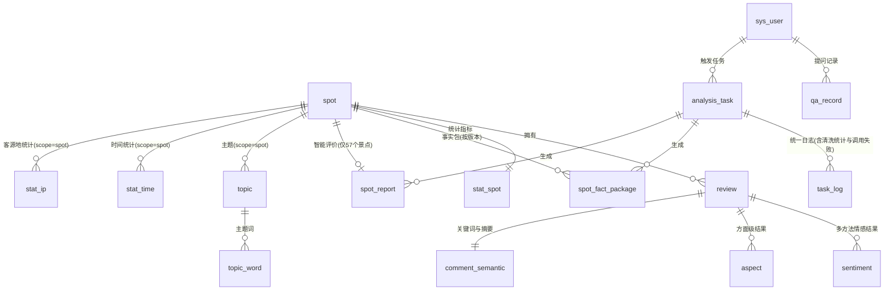

# ER 图（实体关系图）

**项目名称**：基于 DeepSeek 的西藏旅游景点智能评价与分析系统
**文档版本**：V1.0
**编制日期**：2026-09-20
**数据库**：MySQL 8，库名 `tibet_review`
**配套文档**：`docs/database/数据库设计说明.md`（字段类型与约束详解）、`docs/database/建表脚本.sql`

> 说明：ER 图使用 Mermaid `erDiagram` 语法，可直接在支持 Mermaid 的编辑器中渲染与修改。

---

## 1. 全局 ER 图



> **读图提示**：`stat_time`、`stat_ip`、`topic` 通过 `scope_type`／`scope_id` 同时支持"全局"与"单景点"两种粒度。**景点对比无专用表**——对比指标由后端实时查询 `stat_spot`／`sentiment`／`aspect` 计算，DeepSeek 解读直接返回前端。

---

## 2. 核心数据表（来源：最终数据集 CSV）

```mermaid
erDiagram
    spot {
        int unsigned spot_id PK "景点主键"
        varchar spot_name UK "景点名称(837个唯一值)"
        varchar source_scope "来源口径: tibet/route"
        varchar address "地址(837/837有值)"
        varchar open_time "开放时间(546/837)"
        varchar phone "官方电话(仅99/837)"
        text introduction "景点介绍(738/837)"
        int unsigned review_count "评论量(中位数5)"
        tinyint has_full_evaluation "是否有完整评价资格(57个=1)"
        datetime created_at
    }

    review {
        bigint unsigned comment_id PK "评论编号(唯一率100%)"
        int unsigned spot_id FK "所属景点"
        tinyint score "评分1-5(37条空)"
        varchar score_desc "评分描述"
        text content "评论内容(1条空)"
        smallint content_length "正文字数(中位数31)"
        date publish_date "发布时间"
        smallint publish_year "发布年"
        tinyint publish_month "发布月"
        varchar ip_location "IP归属地(66种)"
        tinyint ip_is_unknown "是否未知(2022-08前100%)"
        varchar ip_province "标准化省份(仅2022-08后有效)"
        varchar user_nick "用户昵称(非稳定ID)"
        int unsigned like_count "点赞数(非零18.35%)"
        tinyint image_count "图片数"
        text image_urls "图片URL(30493条空=无图)"
        tinyint is_low_info "低信息量(≤10字,17.33%)"
        tinyint is_dup_content "重复正文(7.18%)"
        int unsigned dup_group_id "重复组号(1285组)"
        datetime created_at
    }

    spot ||--o{ review : "1:N"
```

**字段来源核对**：`spot` 的 `spot_name／address／open_time／phone／introduction` 来自 CSV 的 5 个景点级字段（名称＋4 个景点级字段）；`review` 的 `comment_id／score／score_desc／content／publish_date／ip_location／user_nick／like_count／image_count／image_urls` 来自 CSV 的 10 个评论级字段；`content_length／publish_year／publish_month／ip_is_unknown／ip_province／is_low_info／is_dup_content／dup_group_id` 为清洗阶段派生字段。**CSV 15 字段全部有落库位置，无遗漏、无凭空新增。**

---

## 3. 分析结果表（语义与主题）

```mermaid
erDiagram
    review {
        bigint unsigned comment_id PK
        int unsigned spot_id FK
    }

    sentiment {
        bigint unsigned comment_id PK_FK "评论编号"
        int unsigned spot_id FK "冗余景点"
        varchar method PK "deepseek/mllib/dict"
        varchar polarity "positive/neutral/negative"
        tinyint intensity "情感强度1-5"
        decimal confidence "置信度(MLlib概率)"
        tinyint is_valid "是否通过校验"
        text raw_json "模型原始返回"
        datetime created_at
    }

    aspect {
        bigint unsigned id PK
        bigint unsigned comment_id FK "评论编号"
        int unsigned spot_id FK "景点"
        varchar aspect_name "方面名(10类候选)"
        varchar polarity "该方面倾向"
        varchar evidence "原文证据(须为原文子串)"
        varchar method "来源方法"
        datetime created_at
    }

    comment_semantic {
        bigint unsigned comment_id PK_FK
        int unsigned spot_id FK
        varchar keywords "关键词(≤5个)"
        varchar summary "一句话摘要(≤40字)"
        varchar source "deepseek/rule"
        datetime created_at
    }

    topic {
        int unsigned topic_id PK
        varchar scope_type "global/spot"
        int unsigned scope_id "景点ID(全局=0)"
        int unsigned topic_index "主题序号"
        decimal topic_rate "主题占比"
        int unsigned sample_size "训练样本量"
        varchar model_version "关联analysis_task"
    }

    topic_word {
        bigint unsigned id PK
        int unsigned topic_id FK
        varchar word "主题词"
        decimal weight "词权重"
        tinyint rank_no "词序号(Top10)"
    }

    stat_overview {
        tinyint unsigned id PK "固定为1（单行汇总）"
        int unsigned total_reviews "59033（由review聚合）"
        int unsigned total_spots "837（由spot聚合）"
        int unsigned tibet_spots "554（由source_scope聚合）"
        int unsigned route_spots "283（由source_scope聚合）"
        date date_start "2015-06-19"
        date date_end "2026-09-16"
        int unsigned valid_ip_sample "35098（口径S1）"
        int unsigned full_eval_spot_count "57"
        varchar stat_version "统计版本"
        datetime updated_at
    }

    review ||--o{ sentiment : "1:N(每条评论×3方法)"
    review ||--o{ aspect : "1:N(每条评论多方面)"
    review ||--|| comment_semantic : "1:1"
    topic ||--o{ topic_word : "1:N"
```

> `sentiment` 的复合主键 `(comment_id, method)` 是"多方法并列"的载体：同一条评论可同时存在 DeepSeek、MLlib、词典法三种判定结果，用于 FR-SA-04 的对照展示与论文对比实验。
>
> **`stat_overview` 的定位**：它是**离线预计算的全局统计汇总表，不作为独立事实源**——表中每个字段都可由 `spot`／`review` 确定性重算，存在的意义是**减少重复聚合、保证总览指标口径一致**（数据总览页与问答的 `DATA_METRIC` 类型共用这几个指标）。明细数据变化时由离线任务重建，**不得手工修改**。

---

## 4. 统计指标表

```mermaid
erDiagram
    spot {
        int unsigned spot_id PK
        varchar spot_name UK
        tinyint has_full_evaluation "≥100条=1"
    }

    stat_spot {
        int unsigned spot_id PK_FK
        int unsigned review_count "评论量"
        decimal avg_score "平均评分"
        int unsigned score_1 "1星条数"
        int unsigned score_2 "2星条数"
        int unsigned score_3 "3星条数"
        int unsigned score_4 "4星条数"
        int unsigned score_5 "5星条数"
        decimal positive_rate "好评率(4-5星)"
        decimal negative_rate "差评率(1-2星)"
        decimal image_rate "图文率"
        int unsigned total_likes "点赞总数"
        decimal low_info_rate "低信息量占比"
        decimal sentiment_positive "DeepSeek正面占比"
        decimal sentiment_neutral "中性占比"
        decimal sentiment_negative "负面占比"
        int unsigned sentiment_sample "情感判定样本量"
        int unsigned valid_ip_sample "有效IP样本量"
        date first_comment_date "最早评论"
        date last_comment_date "最晚评论"
        varchar stat_version "统计版本"
        datetime updated_at
    }

    stat_time {
        int unsigned id PK
        varchar period_type "year/month"
        varchar period "如2025/2025-03"
        varchar scope_type "global/spot"
        int unsigned scope_id "景点ID(全局=0)"
        int unsigned review_count "周期评论量"
        decimal avg_score "平均评分"
        decimal sentiment_avg "情感均值"
        varchar stat_version
    }

    stat_ip {
        int unsigned id PK
        varchar scope_type "global/spot"
        int unsigned scope_id "景点ID(全局=0)"
        varchar ip_province "省份/境外地区"
        int unsigned review_count "该客源地评论量"
        decimal ratio "占比"
        int unsigned sample_size "有效样本总量(35098)"
        tinyint is_overseas "是否境外"
        varchar stat_version
    }

    spot ||--|| stat_spot : "1:1"
    spot ||--o{ stat_time : "1:N(scope=spot)"
    spot ||--o{ stat_ip : "1:N(scope=spot)"
```

> **口径约束（BR-01）**：`stat_ip` **只写入 `publish_date ≥ 2022-08-01` 的评论**；`sample_size` 字段承载"有效样本 35,098 条"这一口径说明，供前端展示（BR-10）。

---

## 5. 解释结果表（事实与模型输出分离）

```mermaid
erDiagram
    spot {
        int unsigned spot_id PK
        varchar spot_name UK
    }

    spot_fact_package {
        bigint unsigned id PK
        int unsigned spot_id FK "景点"
        varchar version "事实包版本(v1...)"
        json package_json "事实包完整快照"
        int unsigned review_count "快照时评论量"
        varchar stat_version "依据的统计版本"
        datetime generated_at
        bigint unsigned task_id FK "生成任务"
    }

    spot_report {
        int unsigned spot_id PK_FK "一景一报告"
        varchar fact_package_version FK "依据的事实包版本"
        text summary "综合评价"
        json advantages_json "主要优势"
        json issues_json "主要问题"
        json visitor_focus_json "游客关注点"
        varchar model "模型名"
        varchar prompt_version "Prompt版本"
        tinyint need_review "数字校验未通过标记"
        int unsigned token_usage "token用量"
        datetime generated_at
        bigint unsigned task_id FK
    }

    spot ||--o{ spot_fact_package : "1:N(按版本)"
    spot ||--o| spot_report : "1:0..1(仅57个景点)"
    spot_fact_package ||--o| spot_report : "版本追溯"
```

> **设计要点**：`spot_report` 与 `spot_fact_package` 通过 `fact_package_version` 关联，实现"数据负责事实"的可追溯——任何一段评价文本都能回查到当时依据的数字（FR-IE-07）。
>
> **关于景点对比**：原 `spot_comparison` 表已按精简要求**删除**。对比指标（评论量／均分／好评率／评分分布／情感分布／图文率／方面对比）由后端**实时查询** `stat_spot`／`sentiment`／`aspect` 计算；DeepSeek 生成的对比解读**直接返回前端**，不落库。详见 `数据库设计说明.md` §0.1 决策 D-4。

---

## 6. 用户、业务记录与运维表

```mermaid
erDiagram
    sys_user {
        int unsigned user_id PK
        varchar username UK "登录名"
        varchar password_hash "加盐哈希(禁明文)"
        varchar nickname "显示名"
        varchar role "user/admin"
        tinyint status "1正常/0停用"
        datetime created_at
        datetime last_login_at
    }

    qa_record {
        bigint unsigned qa_id PK
        int unsigned user_id FK "提问用户(游客为NULL)"
        varchar session_key "游客标识"
        varchar question "用户问题"
        varchar question_type "六类之一或OUT_OF_SCOPE"
        varchar spot_ids "识别到的景点"
        text answer "回答(含拒答说明)"
        json sources_json "回答依据的数据来源"
        varchar caliber_note "数据口径说明"
        tinyint need_review "数字校验标记"
        varchar model
        datetime created_at
    }

    analysis_task {
        bigint unsigned task_id PK
        varchar task_type "clean/stat/mllib/lda/semantic/fact_package/spot_report"
        varchar task_name
        varchar status "pending/running/success/failed/partial"
        int unsigned total_count "计划处理量"
        int unsigned success_count "成功量"
        int unsigned fail_count "失败量"
        int unsigned skip_count "跳过量(幂等跳过)"
        datetime started_at
        datetime finished_at
        int unsigned cost_seconds "耗时"
        int unsigned operator_id FK "触发人"
        varchar error_message
        varchar model_type "模型类型nb/lr/lda(原ml_model)"
        varchar model_version "模型版本(原ml_model)"
        varchar model_path "模型持久化路径(原ml_model)"
        int unsigned random_seed "随机种子(原ml_model)"
        json model_metrics_json "训练样本量+评估指标(原ml_model)"
        datetime created_at
    }

    task_log {
        bigint unsigned log_id PK
        bigint unsigned task_id FK
        varchar level "INFO/WARN/ERROR"
        varchar stage "阶段名/步骤名/失败场景"
        varchar message "日志内容/失败原因"
        varchar ref_key "关联标识(原llm_failure)"
        tinyint retry_count "已重试次数(原llm_failure)"
        tinyint resolved "是否已补跑(原llm_failure)"
        int unsigned processed_count "当前处理量"
        json detail_json "input/output/dropped/abnormal计数(原clean_log)"
        datetime created_at
    }

    sys_user ||--o{ qa_record : "1:N"
    sys_user ||--o{ analysis_task : "触发"
    analysis_task ||--o{ task_log : "1:N"
```

> **本设计已删除的 4 张表及去处**（详见 `数据库设计说明.md` §0.1）：
>
> | 已删除 | 信息去处 |
> |---|---|
> | `ml_model` | → `analysis_task` 的 `model_type`／`model_version`／`model_path`／`random_seed`／`model_metrics_json` |
> | `llm_failure` | → `task_log` 的 `level=WARN/ERROR` ＋ `stage`／`ref_key`／`retry_count`／`resolved` |
> | `clean_log` | → `task_log` 的 `stage=步骤名` ＋ `detail_json` 四类计数 |
> | `spot_comparison` | → 对比指标后端实时计算、DeepSeek 解读直接返回前端，不落库 |
>
> **未建的表及原因**：
> - 不建权限表／角色权限关联表 —— 角色仅三档且从简（范围外事项第 12 项）
> - 不建用户画像／行为表 —— CSV 中"用户昵称"非稳定 ID，80.71% 用户仅 1 条评论，无行为序列，无法建模
> - 不建多轮对话上下文表 —— 业务需求明确"不做复杂的长期上下文记忆"（FR-QA-08）
> - 不建推荐相关表 —— 无用户-物品矩阵（范围外事项第 3 项）
> - 不建实时／增量表 —— 无实时数据源（技术栈红线）
> - 不建独立清洗日志表 —— 与任务日志同属"任务执行过程记录"，已合并（避免两套日志体系）

---

## 7. 关系基数汇总

| 关系 | 基数 | 约束方式 |
|---|---|---|
| `spot` — `review` | 1 : N（837 : 59,033） | `review.spot_id` 外键 |
| `spot` — `stat_spot` | 1 : 1（837 : 837） | `stat_spot.spot_id` 主键兼外键 |
| `spot` — `spot_report` | 1 : 0..1（837 : 57） | 仅 ≥100 条评论的景点有报告 |
| `spot` — `spot_fact_package` | 1 : N（按版本） | 唯一键 `(spot_id, version)` |
| （景点对比） | — | **无专用表**：指标实时计算、解读直接返回 |
| `review` — `sentiment` | 1 : N（1 : 3 方法） | 唯一键 `(comment_id, method)` |
| `review` — `aspect` | 1 : N（1 : 方面数） | 唯一键 `(comment_id, aspect_name)` |
| `review` — `comment_semantic` | 1 : 1 | `comment_id` 主键兼外键 |
| `topic` — `topic_word` | 1 : N | `topic_word.topic_id` 外键 |
| `sys_user` — `qa_record` | 1 : N | `qa_record.user_id` 可空（游客） |
| `analysis_task` — `task_log` | 1 : N | 追溯"由哪次任务产生"，含清洗统计与调用失败记录 |

---

## 8. 支撑业务功能的表组合（可追溯）

| 业务功能 | 主用表 | 次要表 |
|---|---|---|
| M1 数据总览 | `stat_overview`、`stat_spot`、`stat_time`、`stat_ip` | `spot` |
| M2 景点分析 | `spot`、`stat_spot`、`sentiment`、`aspect`、`topic`、`topic_word` | `review`（代表评论）、`comment_semantic` |
| M3 景点智能评价 | `spot_report`、`spot_fact_package` | `analysis_task`（追溯） |
| M4 景点对比 | `stat_spot`、`aspect`、`sentiment` | `spot`（**无专用表，实时计算**） |
| M5 智能问答 | `qa_record` ＋ 按问题类型检索上述结果表 | `sys_user` |
| M6 系统管理 | `sys_user`、`analysis_task`、`task_log` | — |

**结论**：**17 张表**全部可被至少一个业务功能使用，**不存在无功能使用的表**；同时每个业务功能都能找到对应的表支撑，**不存在无数据支撑的功能**。

---

## 9. 表数量变更说明（V1.1）

| 项 | 变更前 | 变更后 |
|---|---|---|
| 表总数 | 21 张 | **17 张（已冻结）** |
| 删除 | — | `ml_model`、`llm_failure`、`clean_log`、`spot_comparison` |
| 增强 | — | `analysis_task` 增加 5 个模型实验字段；`task_log` 增加 4 个失败/统计字段 |
| 核心旅游数据表 | `spot`、`review`（源自 CSV 15 字段） | **未改动** |
| 语义/主题/统计/解释结果表 | `sentiment`、`aspect`、`comment_semantic`、`topic`、`topic_word`、`stat_*`、`spot_fact_package`、`spot_report` | **未改动** |
| 功能影响 | — | 无功能被削弱；**景点对比的解读不再缓存**（每次调用模型） |

**后续不再继续压缩表数量**；如因开发需要调整，须先更新 `数据库设计说明.md` 与 `建表脚本.sql` 并保持三者一致。

---

## 10. 数据库初始化状态

本 ER 图对应的 `tibet_review` 库**已在开发机实际建成并校验通过**（2026-09-20，MySQL 8.0.32）：

| 项 | 实际值 | 与设计一致 |
|---|---|---|
| 表数 | **17** | ✅ |
| 主键 | 17 | ✅ |
| 唯一约束 | 7 | ✅ |
| 外键 | 14 | ✅ |
| 字符集 | `utf8mb4` | ✅ |

详细执行记录与外键清单见 `数据库设计说明.md` §10.1。

---

**文档结束**
