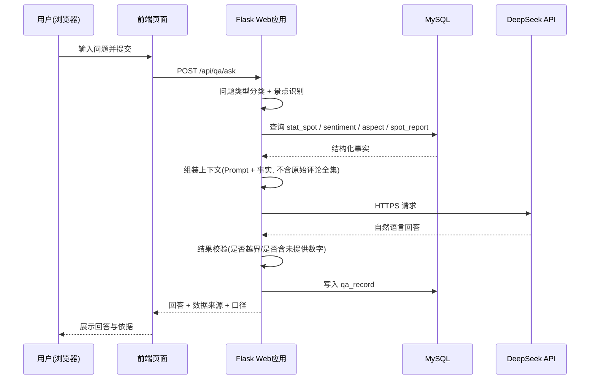
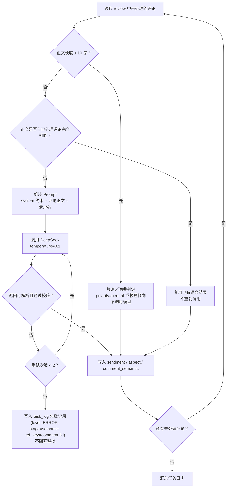
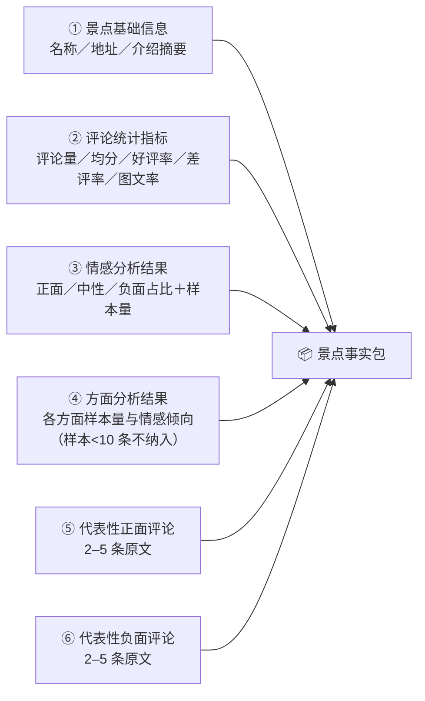
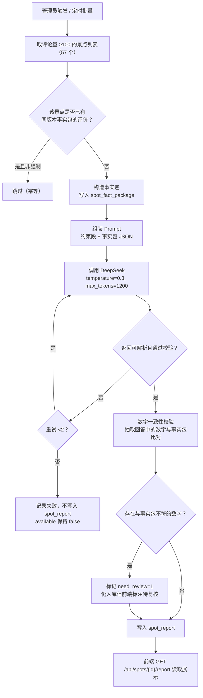
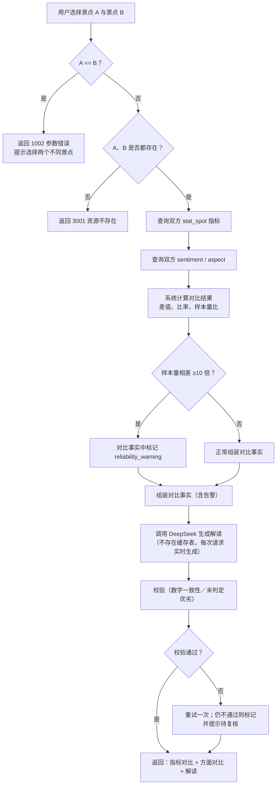
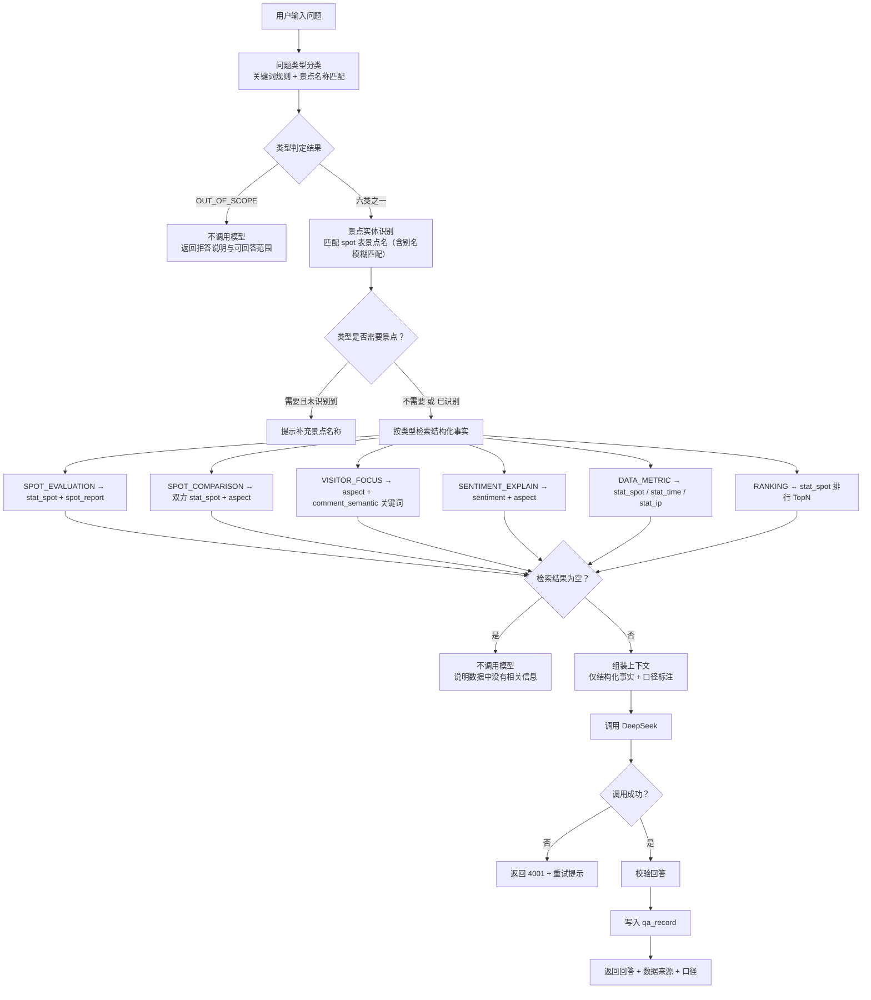

# 详细设计说明书

**项目名称**：基于 DeepSeek 的西藏旅游景点智能评价与分析系统
**文档版本**：V1.0
**编制日期**：2026-09-20
**对应阶段**：设计阶段 — 详细设计
**上游依据**：`开题/业务需求文档.md`（V1.1）、`docs/architecture/C4架构视图.md`、C4 三层视图
**下游用途**：编码实现、数据库建表、系统测试验收

> **一致性声明**：本文档中的每一个模块均可追溯到 C4 组件编号（`C-API-*`／`C-BAT-*`／`C-SPK-*`），**不存在 C4 中未定义的模块**；本文档不引入任何技术栈红线中的组件。

---

## 目录

1. 系统总体设计
2. 系统分层结构
3. 模块划分
4. 各模块职责
5. 核心业务流程
6. 后端接口设计
7. DeepSeek 调用设计
8. 数据处理流程
9. 数据库设计（索引见 `docs/database/`）
10. 前后端交互设计
11. 异常处理设计
12. 日志与可追溯设计
13. 安全与权限设计
14. 性能与批处理设计
15. AI 功能详细设计（A～E）

---

## 1. 系统总体设计

### 1.1 设计目标

| 目标 | 量化标准 |
|---|---|
| 事实与解释分离 | 所有数值指标由系统计算；模型输出仅落解释类表 |
| 在线响应快 | 常规页面 ≤3 秒，已生成内容 ≤2 秒，且不触发模型调用 |
| 成本可控 | 评论级模型调用 ≤45,000 次；同内容不重复调用 |
| 可重跑可追溯 | 每个处理环节有任务号与日志；评价结果保留事实包快照 |
| 规模可控 | 单机、单库、进程级部署，不引入中间件 |

### 1.2 总体架构形态

采用 **"离线批处理 + 只读在线服务"** 两段式：

```
【离线链路】最终数据集 →(Python 清洗)→ MySQL →(Spark 统计/基线/LDA)→ MySQL
                                          ↓
                                 (Python 调 DeepSeek 语义抽取)→ MySQL
                                          ↓
                                 (Python 构造事实包 + 生成景点评价)→ MySQL

【在线链路】浏览器 →(REST)→ Flask →(只读 SQL)→ MySQL
                              └→(仅问答/对比)→ DeepSeek API → 回答/解读
```

### 1.3 关键设计约束（来自业务需求文档）

| 编号 | 约束 | 实施位置 |
|---|---|---|
| BR-01 | 客源地统计仅用 `发布时间 ≥ 2022-08-01`（35,098 条） | `C-SPK-02` 统计聚合组件、`C-API-04` 数据统计组件 |
| BR-02 | 仅 ≥100 条评论的 57 个景点生成完整智能评价 | `C-BAT-07` 评价生成组件、`C-API-09` 智能评价组件 |
| BR-03 | <100 条的景点只展示基础统计并提示样本不足 | `C-API-09`、`C-API-03` |
| BR-04 | 某方面样本 <10 条时不出结论 | `C-API-07` 方面分析组件 |
| BR-05 | 正文 ≤10 字标记低信息量，默认不调模型 | `C-BAT-04` 去重与分层组件 |
| BR-06 | 重复正文只调用一次并复用结果 | `C-BAT-04` |
| BR-07 | 生成内容必须基于给定事实，禁止引入外部知识 | `C-BAT-07`、`C-API-10`、`C-API-11` 的 Prompt 约束 |
| BR-08 | 问答仅支持六类问题，超范围拒答 | `C-API-11` 智能问答组件 |
| BR-09 | 景点级字段只作展示，不作分析维度 | 数据库层拆分（`spot` 维表） |
| BR-10 | 受口径影响的数据须显示口径与有效样本量 | 所有统计类接口返回 `caliber_note` 字段 |
| BR-11 | 数据文件只读，转换结果另存新文件 | `C-BAT-03` 清洗组件 |
| BR-12 | 生成类结果落库，重复访问不重复调用模型 | `C-API-09`／`C-API-10`／`C-API-11` |

---

## 2. 系统分层结构

```
┌──────────────────────────────────────────────────────────────┐
│ 展示层  Presentation                                          │
│   数据总览页 / 景点分析页 / 智能评价页 / 对比页 / 问答页 / 后台 │
│   技术：HTML + ECharts + axios                                │
└───────────────────────────┬──────────────────────────────────┘
                            │ HTTP/JSON (REST)
┌───────────────────────────▼──────────────────────────────────┐
│ 接口层  API（C-API-01 … C-API-14）                             │
│   路由注册、参数绑定与校验、统一响应包装、异常捕获与错误码        │
└───────────────────────────┬──────────────────────────────────┘
                            │ 服务调用
┌───────────────────────────▼──────────────────────────────────┐
│ 业务服务层  Service（C-API-02 … C-API-11）                     │
│   业务规则实施：样本门槛、口径标注、代表性评论筛选、              │
│   事实检索与上下文组装、Prompt 组装与结果校验                    │
└───────────────────────────┬──────────────────────────────────┘
                            │
┌───────────────────────────▼──────────────────────────────────┐
│ 集成层  Integration（C-API-12 DeepSeek 调用 / C-BAT-* 批处理）   │
│   外部 API 封装、超时重试、限并发、幂等控制                      │
└───────────────────────────┬──────────────────────────────────┘
                            │ SQL / JDBC
┌───────────────────────────▼──────────────────────────────────┐
│ 数据访问层  DAO（C-API-13）                                    │
│   参数化 SQL、连接管理、结果集映射、批量写入与 upsert            │
└───────────────────────────┬──────────────────────────────────┘
                            │
┌───────────────────────────▼──────────────────────────────────┐
│ 数据层  Data                                                  │
│   MySQL 8：明细表 / 结果表 / 配置与日志表                       │
└──────────────────────────────────────────────────────────────┘
```

**分层约束**：展示层不得直接访问数据库；接口层不写业务规则；业务层不拼 SQL；数据访问层不含业务判断。

---

## 3. 模块划分

| 模块号 | 模块名称 | 容器 | C4 组件 | 对应需求 |
|---|---|---|---|---|
| M1 | 数据总览模块 | Flask | C-API-02、C-API-04 | FR-OV-01～09 |
| M2 | 景点分析模块 | Flask + Spark | C-API-03～08、C-SPK-02～05 | FR-SA-01～10 |
| M3 | 景点智能评价模块 | Python 批处理 + Flask | C-BAT-06/07、C-API-09 | FR-IE-01～09 |
| M4 | 景点对比模块 | Flask | C-API-10、C-API-12 | FR-CP-01～06 |
| M5 | 智能问答模块 | Flask | C-API-11、C-API-12 | FR-QA-01～10 |
| M6 | 系统管理模块 | Flask | C-API-01、C-API-14 | FR-SY-01～06、NR-S-* |
| M7 | 数据清洗与预处理模块（离线） | Python 批处理 | C-BAT-01～05 | 数据需求 §3 |
| M8 | 离线分析模块（离线） | Spark | C-SPK-01～05 | NR-P-06、FR-SA-02/04/06 |
| M9 | 语义理解批处理模块（离线） | Python 批处理 | C-BAT-04/05 | FR-SA-03/05、CC-1～4 |

---

## 4. 各模块职责

### 4.1 M1 数据总览模块（C-API-02、C-API-04）

| 项 | 内容 |
|---|---|
| 输入 | 无参数／时间粒度参数 |
| 处理 | 读取 `stat_overview`、`stat_time`、`stat_ip`、`spot` 聚合结果；附加口径说明 |
| 输出 | 规模指标、评分分布、时间趋势、分档分布、客源地分布、数据说明 |
| 规则 | 客源地仅用 2022-08 后样本并返回 `caliber_note`（BR-01／BR-10）；时间趋势须带"非客流量"声明（FR-OV-03） |

### 4.2 M2 景点分析模块（C-API-03～08、C-SPK-02～05）

| 项 | 内容 |
|---|---|
| 输入 | 景点 ID、可选方法参数 |
| 处理 | 读 `spot` 维表与 `stat_spot`；读 `sentiment`（多方法）、`aspect`、`topic`、代表性评论 |
| 输出 | 基础信息、统计指标、情感占比、方面分析、主题、代表评论、时间趋势、客源地 |
| 规则 | 缺失字段不展示（FR-SA-01）；评论量 <100 提升级为"样本不足"并隐藏评价性内容（BR-03）；方面样本 <10 不出结论（BR-04）；代表评论优先非重复正文（FR-SA-07） |

### 4.3 M3 景点智能评价模块（C-BAT-06/07、C-API-09）

| 项 | 内容 |
|---|---|
| 输入（离线） | ≥100 条评论的景点列表 |
| 处理（离线） | 构造事实包 → 调 DeepSeek → 校验 → 落库；同时保存事实包快照 |
| 输出（在线） | 综合评价、主要优势、主要问题、游客关注点 ＋ 事实依据回显 |
| 规则 | <100 条不生成也不提供（BR-02）；内容必须基于事实包（BR-07）；在线只读、不调模型（BR-12／CC-1／CC-2） |
| 幂等 | 同一景点同一版本事实包已生成则跳过；管理员可强制重新生成（FR-IE-08） |

### 4.4 M4 景点对比模块（C-API-10、C-API-12）

| 项 | 内容 |
|---|---|
| 输入 | 两个景点 ID |
| 处理 | 校验不同景点 → 读双方 `stat_spot`／`sentiment`／`aspect` → **系统计算对比** → 组装对比事实 → 调 DeepSeek 生成解读 → 返回 |
| 输出 | 指标对比表／图 ＋ 方面对比 ＋ 自然语言解读 |
| 规则 | 相同景点拒绝；样本相差 ≥10 倍时解读须标注可靠性影响（FR-CP-05）；解读不得判定绝对优劣（BR-07） |
| 缓存 | **不做缓存**（已删除 `spot_comparison` 表）：解读每次请求实时生成并直接返回前端，不落库（见 §15.D.3、决策 D-4） |

### 4.5 M5 智能问答模块（C-API-11、C-API-12）

| 项 | 内容 |
|---|---|
| 输入 | 自然语言问题、可选登录态 |
| 处理 | ① 问题类型分类（六类）；② 景点实体识别；③ 按类型检索结构化事实；④ 组装上下文；⑤ 调 DeepSeek；⑥ 返回并保存记录 |
| 输出 | 自然语言回答 ＋ 所依据的数据来源与口径 |
| 规则 | 超六类拒答（BR-08）；无数据时明确说明而非杜撰（BR-07）；**只传结构化事实，不传原始评论全集**（CC-3／FR-QA-10） |
| 历史 | 保存问题与回答；登录用户可查（FR-QA-08）；不做长期上下文记忆 |

### 4.6 M6 系统管理模块（C-API-01、C-API-14）

| 项 | 内容 |
|---|---|
| 功能 | 注册／登录／注销、角色校验、用户管理、口径配置查看、任务日志与进度查询 |
| 规则 | 密码加密存储（NR-S-01）；管理操作须管理员角色（NR-S-02）；不做复杂 RBAC |

### 4.7 M7 数据清洗与预处理模块（C-BAT-01～05）

| 项 | 内容 |
|---|---|
| 输入 | `旅游评论数据集_最终版.csv`（只读） |
| 处理 | **行数校验（C-BAT-02 数据校验组件）** → 字段规范化（日期、IP、评分一致性）→ 评论级／景点级拆分 → 低信息量与重复正文标记 → 写库 → 输出新版本规范文件 |
| 输出 | `spot`、`review`、`task_log`（清洗各步骤的输入量／输出量／丢弃量／异常量写入 `task_log.detail_json`） |
| 组件分工 | `C-BAT-01` 任务编排与断点续跑、`C-BAT-02` 数据校验、`C-BAT-03` 清洗与规范化、`C-BAT-04` 去重与分层、`C-BAT-05` 语义抽取（衔接 M9） |
| 规则 | 行数必须等于 59,033（NR-R-03）；不覆盖原始数据（BR-11）；全程断点续跑（NR-R-01） |

### 4.8 M8 离线分析模块（C-SPK-01～05）

| 项 | 内容 |
|---|---|
| 输入 | MySQL 中清洗后的 `review` |
| 处理 | `C-SPK-01` 数据加载 → `C-SPK-02` Spark SQL 四类聚合 → `C-SPK-03` **特征工程（中文分词／停用词过滤／TF-IDF 向量化）** → `C-SPK-04` MLlib 三分类训练与批量推理 → `C-SPK-05` LDA 主题 |
| 输出 | `stat_spot`、`stat_time`、`stat_ip`、`sentiment`(MLlib)、`topic`、`topic_word`；**模型版本与实验指标写入 `analysis_task`**（`model_type`／`model_version`／`model_path`／`random_seed`／`model_metrics_json`） |
| 规则 | 客源地聚合仅取 2022-08 后（BR-01）；固定随机种子保证可复现（NR-R-06） |
| 说明 | `C-SPK-03` 特征工程为 `C-SPK-04`／`C-SPK-05` 的共同前置，不单独产出数据表 |

### 4.9 M9 语义理解批处理模块（C-BAT-04/05）

| 项 | 内容 |
|---|---|
| 输入 | `review` 中未处理的评论 |
| 处理 | 分层过滤（≤10 字走规则）→ 重复正文复用 → 分批调 DeepSeek → JSON 校验 → 幂等写入 |
| 输出 | `sentiment`(DeepSeek)、`aspect`、`comment_semantic`（关键词／摘要） |
| 规则 | 见 §15.A；调用量上限 45,000 次（NR-P-07） |

---

## 5. 核心业务流程

> 全部流程图见 `docs/diagrams/`。本节给出流程要点与跳转关系。

| 流程 | 流程图文件 | 要点 |
|---|---|---|
| 系统总体流程 | `系统总体流程图.md` | 数据集 →清洗→Spark→DeepSeek→结构化结果→MySQL→事实包→评价／对比／问答→Flask→ECharts |
| 评论数据处理流程 | `数据处理流程图.md` | 行数校验 → 规范化 → 维度拆分 → 标记 → 落库 → 统计 → 语义 |
| DeepSeek 语义分析流程 | `DeepSeek语义分析流程图.md` | 分层过滤 → 去重复用 → Prompt → 调用 → JSON 校验 → 重试 → 落库 |
| 景点智能评价流程 | `景点智能评价流程图.md` | 门槛判断 → 事实包 → 调用 → 校验 → 落库 → 在线读取 |
| 景点对比流程 | `景点对比流程图.md` | 选择 → 校验 → 双方指标 → 对比事实 → 解读 → 展示（**不缓存**） |
| 智能问答流程 | `智能问答流程图.md` | 分类 → 景点识别 → 事实检索 → 上下文 → 调用 → 回答 → 存记录 |
| 用户登录与权限流程 | `用户登录与权限流程图.md` | 注册 → 登录 → 会话 → 角色校验 → 放行／拒绝 |

---

## 6. 后端接口设计

### 6.1 通用约定

| 项 | 约定 |
|---|---|
| 基础路径 | `/api` |
| 数据格式 | 请求与响应均为 `application/json; charset=utf-8` |
| 认证方式 | 登录后写入服务端会话，前端携带 Cookie；管理接口额外校验角色 |
| 统一响应体 | `{ "code": 0, "message": "ok", "data": {...} }`；`code != 0` 表示业务失败 |
| 错误码 | 见 §6.4 |
| 分页 | `page`（从 1 开始）、`page_size`（默认 20，上限 100） |
| 口径标注 | 凡受 S1–S6 口径影响的接口，响应 `data` 中必须含 `caliber_note` 与 `sample_size` |

### 6.2 接口清单

| # | 方法 | 路径 | 说明 | 组件 | 认证 |
|---|---|---|---|---|---|
| 1 | POST | `/api/auth/register` | 用户注册 | C-API-01 | 否 |
| 2 | POST | `/api/auth/login` | 登录 | C-API-01 | 否 |
| 3 | POST | `/api/auth/logout` | 注销 | C-API-01 | 是 |
| 4 | GET | `/api/auth/me` | 当前用户与角色 | C-API-01 | 是 |
| 5 | GET | `/api/overview/summary` | 数据集规模与评分分布 | C-API-02 | 否 |
| 6 | GET | `/api/overview/trend` | 评论量时间趋势（`granularity=year\|month`） | C-API-02 | 否 |
| 7 | GET | `/api/overview/distribution` | 评论量分档与来源口径构成 | C-API-02 | 否 |
| 8 | GET | `/api/overview/provinces` | 客源地分布（限 2022-08 后） | C-API-02 | 否 |
| 9 | GET | `/api/overview/data-note` | 数据来源、质量与已知局限说明 | C-API-02 | 否 |
| 10 | GET | `/api/spots` | 景点列表（`keyword`、`page`、`page_size`） | C-API-03 | 否 |
| 11 | GET | `/api/spots/ranking` | 景点排行（`by=reviews\|rating\|positive_rate`） | C-API-03 | 否 |
| 12 | GET | `/api/spots/{spot_id}` | 景点详情与统计指标 | C-API-03/04 | 否 |
| 13 | GET | `/api/spots/{spot_id}/trend` | 景点时间趋势 | C-API-04 | 否 |
| 14 | GET | `/api/spots/{spot_id}/sentiment` | 情感占比（`method=deepseek\|mllib\|dict`） | C-API-05 | 否 |
| 15 | GET | `/api/spots/{spot_id}/aspects` | 方面分析（含样本门槛判断） | C-API-07 | 否 |
| 16 | GET | `/api/spots/{spot_id}/topics` | LDA 主题 | C-API-06 | 否 |
| 17 | GET | `/api/spots/{spot_id}/reviews` | 代表性正负面评论 | C-API-08 | 否 |
| 18 | GET | `/api/spots/{spot_id}/report` | 景点智能评价（含事实依据） | C-API-09 | 否 |
| 19 | POST | `/api/spots/{spot_id}/report/regenerate` | 重新生成评价（异步提交） | C-API-09 | 管理员 |
| 20 | GET | `/api/compare` | 两景点对比与解读（`spot_a`、`spot_b`） | C-API-10 | 否 |
| 21 | POST | `/api/qa/ask` | 提问并获取回答 | C-API-11 | 否 |
| 22 | GET | `/api/qa/history` | 问答历史（登录用户） | C-API-11 | 是 |
| 23 | GET | `/api/admin/tasks` | 批处理任务列表与进度 | C-API-14 | 管理员 |
| 24 | GET | `/api/admin/tasks/{task_id}/logs` | 任务日志明细 | C-API-14 | 管理员 |
| 25 | GET | `/api/admin/users` | 用户列表 | C-API-14 | 管理员 |
| 26 | GET | `/api/admin/caliber` | 系统数据口径配置 | C-API-14 | 管理员 |

### 6.3 关键接口详述

#### `GET /api/spots/{spot_id}/report` — 景点智能评价

**响应示例**

```json
{
  "code": 0,
  "message": "ok",
  "data": {
    "spot_id": 1,
    "spot_name": "布达拉宫",
    "available": true,
    "review_count": 3965,
    "report": {
      "summary": "综合评价文本……",
      "advantages": ["……", "……"],
      "issues": ["……", "……"],
      "visitor_focus": ["……", "……"]
    },
    "basis": {
      "review_count": 3965,
      "avg_score": 4.62,
      "positive_rate": 0.86,
      "negative_rate": 0.07,
      "sentiment": { "positive": 0.78, "neutral": 0.13, "negative": 0.09 },
      "top_aspects": [
        { "name": "风景", "sample_size": 1820, "negative_rate": 0.03 },
        { "name": "门票", "sample_size": 640, "negative_rate": 0.41 }
      ],
      "representative_reviews": {
        "positive": [{ "comment_id": "205409828", "content": "……", "like_count": 12 }],
        "negative": [{ "comment_id": "205409900", "content": "……", "like_count": 8 }]
      }
    },
    "generated_at": "2026-10-20 15:22:31",
    "model": "deepseek-chat",
    "fact_package_version": "v1"
  }
}
```

**数据不足时的响应**

```json
{
  "code": 0,
  "message": "ok",
  "data": {
    "spot_id": 512,
    "spot_name": "某小型景点",
    "available": false,
    "reason": "REVIEW_COUNT_BELOW_THRESHOLD",
    "message_text": "该景点评论量不足 100 条，仅提供基础统计，不生成智能评价。",
    "review_count": 6
  }
}
```

> 注意：`available=false` 是**正常业务响应**（HTTP 200，`code=0`），不是错误。前端据此展示提示语而非报错（BR-03、NR-U-03）。

#### `POST /api/qa/ask` — 智能问答

**请求**

```json
{ "question": "布达拉宫和纳木措哪个更值得去？" }
```

**响应**

```json
{
  "code": 0,
  "message": "ok",
  "data": {
    "qa_id": 128,
    "question": "布达拉宫和纳木措哪个更值得去？",
    "question_type": "SPOT_COMPARISON",
    "spots": ["布达拉宫", "纳木措景区"],
    "answer": "根据两条景点的评论数据……",
    "sources": [
      { "type": "stat_spot", "spots": ["布达拉宫", "纳木措景区"] },
      { "type": "aspect", "spots": ["布达拉宫", "纳木措景区"] }
    ],
    "caliber_note": "统计基于 2022-08 之后的 35,098 条有效 IP 样本（仅客源地相关指标）",
    "answered_at": "2026-10-20 15:30:02"
  }
}
```

**超范围拒答响应**

```json
{
  "code": 0,
  "message": "ok",
  "data": {
    "qa_id": 129,
    "question": "帮我规划一条西藏 7 日游路线",
    "question_type": "OUT_OF_SCOPE",
    "answer": "本系统仅基于旅游评论数据分析结果回答问题，不支持旅游路线规划。可回答的问题包括：景点评价咨询、景点对比、游客关注点、情感与评价方面解释、数据指标查询与景点排行。",
    "sources": [],
    "answered_at": "2026-10-20 15:31:10"
  }
}
```

### 6.4 错误码定义

| code | 含义 | HTTP | 典型场景 |
|---|---|---|---|
| 0 | 成功 | 200 | 含"数据不足""超范围拒答"等正常业务结果 |
| 1001 | 参数缺失或格式错误 | 400 | 缺少必填参数、类型不符 |
| 1002 | 参数越界 | 400 | `page_size` 超上限、`spot_a == spot_b` |
| 2001 | 未登录 | 401 | 访问需登录接口 |
| 2002 | 权限不足 | 403 | 非管理员访问管理接口 |
| 2003 | 用户名已存在 | 409 | 注册重复 |
| 2004 | 用户名或密码错误 | 401 | 登录失败 |
| 3001 | 资源不存在 | 404 | 景点 ID 不存在 |
| 4001 | DeepSeek 调用失败或超时 | 502 | 问答／对比调用失败 |
| 4002 | DeepSeek 返回格式非法 | 502 | JSON 解析失败且重试无效 |
| 5001 | 数据库错误 | 500 | 连接失败、SQL 异常 |
| 5002 | 服务内部错误 | 500 | 未捕获异常 |
| 5003 | 批处理任务失败 | 500 | 管理端查询任务状态 |

---

## 7. DeepSeek 调用设计

### 7.1 调用场景与策略

| # | 场景 | 调用时机 | 输入 | 输出用途 | 是否缓存 |
|---|---|---|---|---|---|
| 1 | **评论语义理解** | 离线批处理 | 单条评论正文（＋景点名） | 写入 `sentiment`、`aspect`、`comment_semantic` | 是（按 `comment_id` 幂等） |
| 2 | **景点智能评价** | 离线批处理 | 景点事实包 | 写入 `spot_report` | 是（按 `spot_id`＋事实包版本） |
| 3 | **景点对比解读** | 在线（用户点击） | 两景点对比事实 | 返回前端展示 | **否**（无缓存表，见 §15.D） |
| 4 | **智能问答回答** | 在线（用户提问） | 检索到的结构化事实 | 返回前端 ＋ 写入 `qa_record` | 否（问题各异） |

> **场景 1、2 一律离线**（CC-1）；场景 3、4 因内容依赖用户当次输入，必须在请求时调用，但**只传结构化事实**（CC-3）。

### 7.2 统一调用封装（C-API-12）

```
入参：prompt_messages（system + user）、max_tokens、temperature、timeout、场景标识
处理：
  1) 从服务端配置读取 API Key 与 base_url（不落前端、不进代码库）
  2) 记录调用开始（场景、景点/评论标识、时间）
  3) 发起 HTTPS 请求（默认 timeout = 60s）
  4) 对返回内容按场景做结构化校验
  5) 失败则按重试策略重试
  6) 记录调用结束（耗时、是否成功、token 用量如可得）
出参：结构化对象 或 失败标识（含失败原因）
```

| 参数 | 取值 | 说明 |
|---|---|---|
| `temperature` | 语义抽取 **0.1**；评价／解读／问答 **0.3** | 抽取类要稳定，生成类可略有变化 |
| `max_tokens` | 语义抽取 512；评价 1200；解读 900；问答 800 | 控制成本与响应时长 |
| `timeout` | 60 秒 | 超过即判失败 |
| 并发 | **3–5** | 避免触发限流（§7.4） |
| 重试 | 最多 **2 次**，间隔 2s / 5s | 仅对网络错误、5xx、限流重试；**参数错误不重试** |

### 7.3 Prompt 设计原则

所有 Prompt 必须包含以下**约束段**（这是 BR-07 的实现手段）：

```
【硬性约束】
1. 只能使用"事实数据"中给出的信息作答，不得使用你自身的知识补充。
2. 不得编造任何数字；引用数字时必须与事实数据完全一致。
3. 事实数据中未提及的信息，直接说明"数据中未涉及"，不要推测。
4. 不得给出"哪个更好"的绝对结论，只能说明数据差异。
5. 只输出 JSON / 指定格式，不要输出解释性前后缀。
```

| 场景 | 附加要求 |
|---|---|
| 语义抽取 | 输出 JSON Schema 固定；`aspects` 从给定候选方面列表中选取，无法归类则忽略该条 |
| 景点评价 | 按"综合评价／主要优势／主要问题／游客关注点"四段输出；每段不少于 2 条、不多于 6 条 |
| 对比解读 | 必须先陈述指标差异，再解释可能原因；须提及样本量差异 |
| 问答 | 先回答结论，再列依据；须标注数据口径 |

### 7.4 调用量控制（对应 CC-4 与 NR-P-07）

| 措施 | 效果 |
|---|---|
| 正文 ≤10 字（10,228 条 / 17.33%）走规则判定，不调模型 | 减少约 1 万次调用 |
| 重复正文（1,285 组 / 4,239 条）只调一次并复用 | 减少约 3,200 次调用 |
| 评论量 <100 条的景点不生成评价 | 减少约 780 个景点的评价调用 |
| 结果落库后不重复调用 | 在线访问不产生评论级调用 |
| 断点续跑，已处理记录跳过 | 重跑不重复计费 |

**理论上限**：评论级调用 **≤45,000 次**；评价调用 ≤57 次；对比与问答调用取决于用户使用次数。

### 7.5 失败兜底

| 失败层级 | 处理方式 |
|---|---|
| 单条评论语义抽取失败（重试后仍失败） | 写入 `task_log`（`level=ERROR`，`stage=semantic`，`ref_key=comment_id`，`message=失败原因`，`retry_count` 记录重试次数，`resolved=0`），**不阻塞整批**；该评论情感字段留空，前端在统计中按"未判定"单列，不计入正负面占比分母 |
| 景点评价生成失败 | 不写入 `spot_report`，保持 `available=false` 并记录原因；前端提示"智能评价暂不可用" |
| 对比解读失败 | 仍返回**完整的指标与方面对比数据**，仅解读部分提示失败可重试（数据部分不依赖模型） |
| 问答调用失败 | 返回 4001 错误码与友好提示，提供重试按钮；不保存残缺记录 |

---

## 8. 数据处理流程

### 8.1 总体数据流（对应 C4 容器图）

```
最终数据集.csv(59033, 只读)
  │ ① 行数校验（必须 = 59033）
  ▼
Python 清洗（C-BAT-03）→ spot / review / task_log(步骤统计)
  │ ② 评论级与景点级拆分；日期/IP 规范化；低信息量与重复标记
  ▼
MySQL
  ├─③ Spark 统计聚合（C-SPK-02）→ stat_spot / stat_time / stat_ip
  ├─④ Spark MLlib 情感基线（C-SPK-04）→ sentiment(method=mllib) / analysis_task(模型指标)
  ├─⑤ Spark LDA 主题（C-SPK-05）→ topic / topic_word
  └─⑥ Python 语义抽取（C-BAT-05）→ sentiment(deepseek) / aspect / comment_semantic
       │
       ▼
     ⑦ 事实包构造（C-BAT-06）→ spot_fact_package
       │
       ▼
     ⑧ 景点评价生成（C-BAT-07）→ spot_report
       │
       ▼
     ⑨ Flask 只读查询 → ECharts 展示
       └─ 问答时：检索事实 → DeepSeek → qa_record
       └─ 对比时：实时计算指标 → DeepSeek 解读 → 直接返回（不落库）
```

### 8.2 各环节输入输出

| 环节 | 输入 | 输出表 | 触发方式 | 幂等键 |
|---|---|---|---|---|
| ① 校验 | CSV | — | 手动 | — |
| ② 清洗 | CSV | `spot`、`review`、`task_log`(步骤统计) | 手动 | `comment_id` |
| ③ 统计 | `review` | `stat_spot`、`stat_time`、`stat_ip` | 手动 | `spot_id`／`(period_type, period)` |
| ④ 情感基线 | `review` | `sentiment`、`analysis_task`(模型指标) | 手动 | `(comment_id, method)` |
| ⑤ 主题 | `review` | `topic`、`topic_word` | 手动 | `topic_id` |
| ⑥ 语义抽取 | `review` | `sentiment`、`aspect`、`comment_semantic` | 手动（可分批） | `comment_id` |
| ⑦ 事实包 | `spot`＋各结果表 | `spot_fact_package` | 手动 | `(spot_id, version)` |
| ⑧ 评价生成 | `spot_fact_package` | `spot_report` | 手动 | `spot_id` |

---

## 9. 数据库设计

> **完整表结构、字段类型、主键外键、ER 图见 `docs/database/数据库设计说明.md` 与 `docs/database/ER图.md`。** 本节仅给出与后端设计直接相关的要点。

### 9.1 核心表清单

| 分类 | 表名 | 说明 |
|---|---|---|
| 用户 | `sys_user` | 用户与角色 |
| 基础数据 | `spot` | 景点维表（837 条，来源=CSV 景点级字段） |
| 基础数据 | `review` | 评论明细（59,033 条，来源=CSV 评论级字段＋清洗标记） |
| 语义结果 | `sentiment` | 多方法情感结果（`comment_id`＋`method`） |
| 语义结果 | `aspect` | 方面级结果 |
| 语义结果 | `comment_semantic` | 关键词、摘要、低信息量标记 |
| 主题结果 | `topic`、`topic_word` | LDA 主题与主题词 |
| 统计指标 | `stat_overview`、`stat_spot`、`stat_time`、`stat_ip` | 全局／景点／时间／客源地统计 |
| 解释结果 | `spot_fact_package` | 事实包快照（**必须保留**，评价的可追溯依据） |
| 解释结果 | `spot_report` | 景点智能评价 |
| 业务记录 | `qa_record` | 问答记录 |
| 运维 | `analysis_task` | 任务 ＋ 模型版本与实验信息 |
| 运维 | `task_log` | 统一日志（流程日志＋清洗步骤统计＋模型调用失败与重试） |

> **表数量说明**：本设计共 **17 张表**（原 21 张，按精简要求删除 `ml_model`／`llm_failure`／`clean_log`／`spot_comparison` 四张，信息去处见 `docs/database/数据库设计说明.md` §0.1）。**景点对比无专用表**：指标实时计算、解读直接返回。

### 9.2 与 CSV 的对应关系（关键）

| CSV 字段 | 落库位置 | 处理 |
|---|---|---|
| 景点名称 | `spot.spot_name`（去重）／`review.spot_id`（外键） | 拆分 |
| 评论编号 | `review.comment_id`（主键） | 直接 |
| 评分 | `review.score` | 直接 |
| 评分描述 | `review.score_desc` | 直接（校验与评分一致） |
| 评论内容 | `review.content` | 直接；另算 `content_length` |
| 发布时间 | `review.publish_date` | 拆 `publish_year`／`publish_month` |
| IP归属地 | `review.ip_location` | 标准化为省份；`unknown` 标记 |
| 用户昵称 | `review.user_nick` | 直接（不用于建模） |
| 点赞数 | `review.like_count` | 直接 |
| 图片数 | `review.image_count` | 直接 |
| 图片URL | `review.image_urls` | 直接（按 `，` 分隔存储） |
| 地址／开放时间／官方电话／景点介绍 | `spot` 表对应字段 | **拆至维表**，仅作展示（BR-09） |

### 9.3 索引设计要点

| 表 | 索引 | 用途 |
|---|---|---|
| `review` | `PK(comment_id)`、`IDX(spot_id)`、`IDX(publish_date)`、`IDX(spot_id, publish_date)` | 统计聚合、时间趋势、客源地过滤 |
| `sentiment` | `PK(comment_id, method)`、`IDX(spot_id, method)` | 多方法对照、景点情感占比 |
| `aspect` | `PK(comment_id, aspect_name)`、`IDX(spot_id, aspect_name)` | 方面聚合 |
| `stat_spot` | `PK(spot_id)`、`IDX(review_count)`、`IDX(avg_score)`、`IDX(positive_rate)` | 排行 |
| `qa_record` | `PK(qa_id)`、`IDX(user_id, created_at)` | 历史查询 |
| `spot_fact_package` | `PK(spot_id, version)` | 版本检索 |

---

## 10. 前后端交互设计

### 10.1 交互方式

| 项 | 约定 |
|---|---|
| 协议 | HTTP/1.1，REST，JSON |
| 前端技术 | 原生 HTML + ECharts + axios（**不引入前端构建链与框架**） |
| 渲染方式 | 服务端提供静态页面，页面内通过 axios 调接口后由 ECharts 渲染 |
| 加载态 | 调接口期间显示加载遮罩；生成类操作（评价／问答／对比）显示进度提示（NR-U-05） |
| 错误展示 | 统一读取响应 `code`／`message`，以提示条展示；`available=false` 按正常提示展示 |
| 口径展示 | 所有图表下方渲染 `caliber_note`（BR-10、NR-U-02） |

### 10.2 页面与接口映射

| 页面 | 主要接口 |
|---|---|
| 数据总览页 | `/api/overview/summary`、`/trend`、`/distribution`、`/provinces`、`/data-note` |
| 景点列表／排行页 | `/api/spots`、`/api/spots/ranking` |
| 景点详情页 | `/api/spots/{id}`、`/trend`、`/sentiment`、`/aspects`、`/topics`、`/reviews` |
| 景点智能评价页 | `/api/spots/{id}/report` |
| 景点对比页 | `/api/compare` |
| 智能问答页 | `/api/qa/ask`、`/api/qa/history`（登录后） |
| 登录／注册页 | `/api/auth/*` |
| 管理后台 | `/api/admin/tasks`、`/tasks/{id}/logs`、`/users`、`/caliber` |

### 10.3 交互时序（以智能问答为例）



---

## 11. 异常处理设计

### 11.1 异常分类与处理

| 类别 | 场景 | 处理策略 | 用户可见提示 |
|---|---|---|---|
| 数据不足 | 景点评论量 <100 | **正常业务分支**，返回 `available=false`；不生成评价 | "该景点评论样本不足，仅提供基础统计" |
| 数据不足 | 某方面样本 <10 | 该方面不返回结论字段，仅返回样本量 | 图表中该维度置灰并标注"样本不足" |
| 数据缺失 | 景点级字段为空 | 不展示该项 | 页面不显示该字段（不留空白） |
| 数据缺失 | 客源地 unknown | 归入"未知"并计数 | 图表展示"未知"占比 |
| 无数据 | 问答检索不到事实 | 不调用模型，直接说明 | "当前数据中没有可用于回答该问题的信息" |
| 超范围 | 问路线／天气／酒店 | 分类为 `OUT_OF_SCOPE`，不调用模型 | 拒答说明 ＋ 可回答范围提示 |
| 外部失败 | DeepSeek 超时／报错 | 重试 2 次；仍失败按场景兜底（§7.5） | "智能问答/评价服务暂时不可用，请稍后重试" |
| 外部失败 | DeepSeek 返回非 JSON | 重试；仍失败写入 `task_log`（`level=ERROR`，`stage=场景`，`ref_key` 定位，`retry_count` 记重试次数） | 同上 |
| 参数错误 | 缺参／类型错 | 返回 1001／1002 | 明确指出错误参数 |
| 权限 | 未登录／非管理员 | 返回 2001／2002 | 跳转登录／提示无权 |
| 数据库 | 连接失败／SQL 异常 | 返回 5001，记录日志 | "系统繁忙，请稍后重试" |
| 批处理 | 行数校验失败 | 终止任务并报警，不写入任何数据 | 管理端可见失败原因（NR-R-03） |
| 批处理 | 部分记录失败 | 记录失败队列，继续处理其余记录 | 任务日志显示成功／失败条数 |

### 11.2 统一异常处理机制

```
业务层抛出领域异常（BusinessException：code + message）
        ↓
接口层统一捕获：
  ├─ BusinessException      → 按 code 返回，HTTP 200 或对应状态码
  ├─ 参数校验异常            → 1001/1002
  ├─ 外部服务异常            → 4001/4002
  ├─ 数据库异常              → 5001
  └─ 未捕获异常              → 5002（同时记录堆栈到日志）
```

**原则**：任何异常都不得把堆栈或 SQL 语句直接返回给前端（NR-S-03 的延伸要求）。

---

## 12. 日志与可追溯设计

### 12.1 日志分层（已统一为两处存储）

> 按精简要求，原 `clean_log` 与 `llm_failure` 已并入 `task_log`，**系统中不再存在两套日志体系**。

| 日志类型 | 存储位置 | 记录内容 | 用途 |
|---|---|---|---|
| 应用运行日志 | 文件（按天滚动） | 请求路径、耗时、状态码、异常堆栈 | 排障 |
| 任务级日志 | `analysis_task` | 任务号、类型、开始/结束时间、计划量、成功/失败/跳过量、耗时、状态、**模型版本与实验指标** | 管理端展示进度（FR-SY-04）、论文实验数据 |
| 明细日志 | `task_log` | 流程日志（`level=INFO`）；**清洗步骤统计**（`stage=步骤名` ＋ `detail_json` 四类计数）；**模型调用失败与重试**（`level=WARN/ERROR` ＋ `stage=场景` ＋ `ref_key` ＋ `retry_count` ＋ `resolved`） | 数据可复核、成本核算、问题定位、失败补跑 |

### 12.2 可追溯链（关键设计）

```
spot_report（景点评价）
   ├─ fact_package_version  → spot_fact_package（事实包快照）
   │      ├─ stat_spot 快照值
   │      ├─ sentiment/aspect 聚合值（含样本量）
   │      └─ 代表性评论 comment_id 列表 → review.content
   ├─ model / generated_at / prompt_version
   └─ task_id → analysis_task（本次生成任务；含模型版本与实验指标）
```

**要求**：打开任一景点评价，都能回答三个问题——① 这段话依据了哪些数据；② 数据是什么时候、由哪次任务算出来的；③ 用的是哪版事实包、哪个模型。这是 FR-IE-06／07 的实现。

**模型实验信息的追溯**：`analysis_task.model_version` ＋ `model_metrics_json` 构成模型实验记录，论文"实验与结果分析"章节的表格直接由此导出，**不再单独建模型表**。

### 12.3 日志规范

| 项 | 约定 |
|---|---|
| 时间格式 | `YYYY-MM-DD HH:mm:ss`，本地时区 `Asia/Shanghai` |
| 分级 | ERROR（需处理）、WARN（可继续）、INFO（关键流程节点）、DEBUG（开发期） |
| 语言 | 输出信息中文化（NR-M-05） |
| 敏感信息 | **禁止**记录 API Key、用户密码明文 |

---

## 13. 安全与权限设计

### 13.1 认证与授权

| 项 | 设计 |
|---|---|
| 密码存储 | 加盐哈希（如 PBKDF2／bcrypt），**不存明文**（NR-S-01） |
| 会话 | 登录成功写入服务端会话，前端携带 Cookie；退出即失效 |
| 角色 | `visitor`（未登录，无记录）／`user`（登录用户）／`admin`（管理员） |
| 授权 | 接口级装饰器校验：需登录接口校验会话；管理接口额外校验 `role == admin`（NR-S-02） |
| 越权防护 | 问答历史查询强制以当前 `user_id` 过滤，不接受前端传入他人 `user_id` |

> **权限从简**：不实现 RBAC 权限表、不做菜单级权限、不做单点登录、不做审计日志体系（范围外事项第 12 项）。

### 13.2 数据安全

| 项 | 设计 |
|---|---|
| SQL 注入 | 全部使用参数化查询（NR-S-03） |
| API Key | 仅存服务端配置文件；`.gitignore` 排除；不下发前端、不打印日志（NR-S-04） |
| 个人信息最小化 | 前端不展示用户昵称全量与 IP 明细；代表性评论展示时对昵称脱敏或不展示（NR-S-05） |
| 数据分发 | 原始数据集不对外分发；仅用于学术分析（NR-S-06） |
| 输入校验 | 问答问题长度上限（如 200 字）、景点 ID 必须为存在的整数、分页参数范围校验 |

---

## 14. 性能与批处理设计

### 14.1 在线性能设计

| 措施 | 说明 | 对应指标 |
|---|---|---|
| 结果预计算 | 统计指标由 Spark 离线算好存 `stat_*`，在线只做单表／小表查询 | NR-P-01 ≤3 秒 |
| 生成结果落库 | 景点评价直接读 `spot_report`，不调模型 | NR-P-02 ≤2 秒 |
| 索引 | 见 §9.3，覆盖排行、时间过滤、景点关联查询 | 同上 |
| 分页 | 景点列表分页，`page_size` 上限 100 | 避免大结果集 |
| 图表数据量控制 | 单图表 ≤5,000 点，超限按维度聚合后返回 | NR-P-08 |
| 对比解读不缓存 | 每次请求实时调用模型生成解读（已删除 `spot_comparison` 表，见 §15.D.3）；指标仍由系统实时计算、响应 ≤2 秒 | FR-CP-05 |
| 问答调用超时控制 | 60 秒超时 ＋ 前端加载提示，避免用户误判卡死 | NR-P-04／NR-U-05 |

### 14.2 批处理设计

| 措施 | 说明 | 对应指标 |
|---|---|---|
| Spark 单机运行 | `local[*]`，驱动内存 `-Xms512m -Xmx2g` | NR-P-06 ≤30 分钟 |
| 分区与并行度 | 按景点或评论范围重分区，避免数据倾斜（景点评论量差异大） | 同上 |
| 批量写库 | JDBC 批量提交（batch size 500–1000），避免逐条写入 | NR-P-05 ≤10 分钟 |
| 断点续跑 | 以 `comment_id`／`spot_id` 为断点键，重跑跳过已完成记录 | NR-R-01 |
| 幂等写入 | `INSERT ... ON DUPLICATE KEY UPDATE`，重复执行不产生重复行 | NR-R-02 |
| 限并发调用 | DeepSeek 并发 3–5，按批提交，批间短暂间隔 | 避免限流 |
| 可复现 | 固定随机种子（MLlib／LDA）；模型版本与评估指标记入 `analysis_task` | NR-R-06 |
| 分批执行 | 语义抽取可按景点或时间范围分批跑，单批失败不影响已完成部分 | NR-P-07 |

### 14.3 数据倾斜处理（本项目特有）

景点评论量极度长尾（最多 3,965 条，中位数 5 条），Spark 聚合易倾斜：

| 措施 | 说明 |
|---|---|
| 长尾景点分层处理 | 评论量 <10 条的 568 个景点单独小作业处理，避免拖慢主作业 |
| 预聚合 | 先按 `spot_id` 局部聚合，再全局合并 |
| 避免全局排序 | 排行取 TopN 用 `orderBy` ＋ `limit`，不做全量排序 |
| 分档统计一次扫描 | 评论量分档用条件聚合（CASE WHEN）一次完成，减少 shuffle |

---

## 15. AI 功能详细设计

### A. 评论语义理解

#### A.1 处理流程



#### A.2 输入格式

```
[system]
你是一个旅游评论语义分析器。只输出 JSON，不要输出任何其他文字。
【硬性约束】
1. 只能依据给定评论文本作答，不得使用你的自身知识补充。
2. 不得编造数字。
3. aspects 只能从候选方面列表中选取：风景 / 交通 / 门票 / 服务 / 设施 / 住宿餐饮 / 高原反应 / 人流拥挤 / 性价比 / 其他
4. 无法归入任何方面时，aspects 返回空数组。

[user]
景点：布达拉宫
评论：风景绝美，但是门票太贵了，而且人特别多。

[输出 JSON Schema]
{
  "polarity": "positive | neutral | negative",
  "intensity": 1-5,
  "aspects": [
    { "aspect": "方面名", "polarity": "positive|neutral|negative", "evidence": "原文中最能体现该方面的片段（不超过30字）" }
  ],
  "keywords": ["关键词1", "关键词2"],
  "summary": "一句话摘要（不超过40字）"
}
```

#### A.3 输出 JSON 结构

```json
{
  "polarity": "negative",
  "intensity": 4,
  "aspects": [
    { "aspect": "风景", "polarity": "positive", "evidence": "风景绝美" },
    { "aspect": "门票", "polarity": "negative", "evidence": "门票太贵了" },
    { "aspect": "人流拥挤", "polarity": "negative", "evidence": "人特别多" }
  ],
  "keywords": ["风景", "门票", "人多"],
  "summary": "风景很美但门票偏贵且人流拥挤"
}
```

#### A.4 结果校验规则

| # | 校验项 | 不通过的处理 |
|---|---|---|
| 1 | 可解析为 JSON | 重试；仍失败入失败队列 |
| 2 | `polarity` ∈ {positive, neutral, negative} | 重试；仍非法则判 `neutral` 并标记 `invalid` |
| 3 | `intensity` 为 1–5 整数 | 截断或钳制到区间 |
| 4 | `aspects` 为数组，`aspect` 属候选列表 | **丢弃非法项**，保留合法项 |
| 5 | `evidence` 必须**是评论原文的子串** | 不匹配则丢弃该方面（**防止模型编造依据**） |
| 6 | `summary` 长度 ≤40 字 | 超长截断 |
| 7 | `keywords` 每项 ≤10 字，数量 ≤5 | 截断 |

> **第 5 条是本设计的关键**：`evidence` 必须能在原文中找到，否则说明模型在编造，弃用该方面。这是"数据负责事实"在单条评论级的落实。

#### A.5 异常结果与失败处理

| 情况 | 处理 |
|---|---|
| JSON 解析失败 | 重试 2 次（间隔 2s／5s） |
| 校验后 `aspects` 全被丢弃 | 保留该评论的 `polarity`／`intensity`，`aspect` 表不写入该评论 |
| 多次失败 | 写 `task_log`（`level=ERROR`、`stage=semantic`、`ref_key=comment_id`、`message=失败原因`、`retry_count`、`resolved=0`），任务继续；后续可按该条件筛选补跑 |
| 批量中断 | 断点续跑，从最后成功的 `comment_id` 之后继续 |

#### A.6 结果入库

| 目标表 | 写入内容 | 幂等键 |
|---|---|---|
| `sentiment` | `comment_id, spot_id, method='deepseek', polarity, intensity, raw_json` | `(comment_id, method)` |
| `aspect` | `comment_id, spot_id, aspect_name, polarity, evidence` | `(comment_id, aspect_name)` |
| `comment_semantic` | `comment_id, keywords, summary, is_low_info` | `comment_id` |

---

### B. 景点事实包

#### B.1 事实包组成

事实包是**景点智能评价的唯一输入**，由六个部分组装（对应 FR-IE-02）：



#### B.2 事实包数据结构（存 `spot_fact_package.package_json`）

```json
{
  "spot_id": 1,
  "spot_name": "布达拉宫",
  "version": "v1",
  "generated_at": "2026-10-18 10:00:00",
  "basic": {
    "address": "拉萨市城关区北京中路35号",
    "intro_excerpt": "布达拉宫位于拉萨市区西北的玛布日山上……"
  },
  "statistics": {
    "review_count": 3965,
    "avg_score": 4.62,
    "positive_rate": 0.86,
    "negative_rate": 0.07,
    "image_rate": 0.49,
    "total_likes": 1820
  },
  "sentiment": {
    "method": "deepseek",
    "sample_size": 3965,
    "positive": 0.78,
    "neutral": 0.13,
    "negative": 0.09
  },
  "aspects": [
    { "aspect": "风景", "sample_size": 1820, "positive_rate": 0.94, "negative_rate": 0.03, "note": null },
    { "aspect": "门票", "sample_size": 640, "positive_rate": 0.52, "negative_rate": 0.41, "note": null },
    { "aspect": "服务", "sample_size": 8, "positive_rate": null, "negative_rate": null, "note": "样本不足，不纳入评价" }
  ],
  "representative_reviews": {
    "positive": [
      { "comment_id": "205409828", "content": "……", "like_count": 12, "score": 5 }
    ],
    "negative": [
      { "comment_id": "205409900", "content": "……", "like_count": 8, "score": 2 }
    ]
  },
  "caliber": {
    "min_review_count": 100,
    "aspect_min_sample": 10,
    "ip_valid_since": "2022-08-01"
  }
}
```

#### B.3 构造规则

| 部分 | 构造规则 |
|---|---|
| 代表性评论筛选 | ① 排除低信息量（≤10 字）；② 优先选取**非重复正文**；③ 按点赞数降序、正文长度 30–200 字优先；④ 正面取 `score ≥4`、负面取 `score ≤2`；⑤ 各取 2–5 条；⑥ 若负面不足则如实留少，**不凑数** |
| 方面纳入条件 | 样本量 ≥10 条（BR-04），不足者以 `note` 标注但不参与评价依据 |
| 数值精度 | 占比保留 2 位小数；样本量必须为整数 |
| 快照 | 每次生成写入新 `version`，不覆盖历史版本（FR-IE-07） |

---

### C. 景点智能评价

#### C.1 处理流程



#### C.2 Prompt 结构

```
[system]
你是旅游景点评论分析报告的撰写者。你只能使用"事实数据"中给出的信息撰写报告。
【硬性约束】
1. 不得使用你自身的知识补充任何事实。
2. 引用数字必须与事实数据完全一致，不得四舍五入后改变量级。
3. 事实数据中未涉及的方面，不要提及。
4. 不得给出绝对的推荐结论，只陈述数据反映的情况。
5. 输出 JSON，字段为 summary / advantages / issues / visitor_focus。

[user]
事实数据：
{ ...事实包 JSON... }

[输出 Schema]
{
  "summary": "综合评价，120–260 字",
  "advantages": ["主要优势，2–6 条，每条 ≤40 字"],
  "issues": ["主要问题，2–6 条，每条 ≤40 字"],
  "visitor_focus": ["游客关注点，2–6 条，每条 ≤40 字"]
}
```

#### C.3 校验与入库

| 校验项 | 处理 |
|---|---|
| JSON 可解析 | 否则重试，仍失败记失败 |
| 四段字段齐全且非空 | 缺失字段重试一次；仍缺失则该字段留空并标记 |
| 条目数量 2–6 条 | 超量截断，少量保留（不编造） |
| **数字一致性** | 抽取回答中的数字（评论量、评分、百分比），与事实包比对，误差超过 0.5 个百分点即标记 `need_review=1` |
| 入库 | `spot_report(spot_id, fact_package_version, summary, advantages_json, issues_json, visitor_focus_json, model, generated_at, need_review, task_id)` |

> **数字一致性校验是"数据负责事实"的强制关卡**：即使模型输出流畅，只要数字与事实包不符就会被标记，前端展示时显示"该内容待人工复核"。

---

### D. 景点对比

#### D.1 处理流程



#### D.2 对比事实结构

```json
{
  "spot_a": { "id": 1, "name": "布达拉宫", "review_count": 3965, "avg_score": 4.62,
              "positive_rate": 0.86, "negative_rate": 0.07,
              "sentiment": { "positive": 0.78, "neutral": 0.13, "negative": 0.09 } },
  "spot_b": { "id": 3, "name": "纳木措景区", "review_count": 3057, "avg_score": 4.55,
              "positive_rate": 0.81, "negative_rate": 0.11,
              "sentiment": { "positive": 0.71, "neutral": 0.16, "negative": 0.13 } },
  "diff": {
    "review_count_delta": -908,
    "avg_score_delta": -0.07,
    "positive_rate_delta": -0.05,
    "sample_ratio": 1.30,
    "reliability_warning": null
  },
  "aspects": [
    { "aspect": "风景", "a": { "sample_size": 1820, "negative_rate": 0.03 },
                        "b": { "sample_size": 1510, "negative_rate": 0.05 } },
    { "aspect": "门票", "a": { "sample_size": 640, "negative_rate": 0.41 },
                        "b": { "sample_size": 220, "negative_rate": 0.18 } }
  ],
  "caliber": { "ip_valid_since": "2022-08-01", "aspect_min_sample": 10 }
}
```

#### D.3 设计要点

| 要点 | 说明 |
|---|---|
| **对比由系统计算** | 差值、比率、样本量比全部由后端算出，模型只做解释（A1 约束） |
| 解读 Prompt 约束 | 必须先陈述数据差异，再解释可能原因；**禁止判定"哪个更好"**；样本悬殊时必须提及可靠性 |
| **不做缓存（按精简要求）** | 已删除 `spot_comparison` 表，解读每次请求实时生成、直接返回前端。理由：该内容约 900 tokens、属用户主动触发的低频操作，且景点对组合随机性大、真实重复率低，缓存收益有限；成本控制的关键在 `spot_report` 的离线预生成（57 个景点必然被反复查看）。**如后续实测发现热门景点对被频繁对比，再评估是否恢复缓存表** |
| 失败降级 | 解读失败时**指标对比与方面对比照常返回**（数据不依赖模型） |
| 方面门槛 | 任一方该方面样本 <10 条，则只展示样本量不出结论（BR-04） |

---

### E. 智能问答

#### E.1 处理流程



#### E.2 问题类型定义

| 类型码 | 类型 | 判定示例 | 检索的数据 |
|---|---|---|---|
| `SPOT_EVALUATION` | 景点评价咨询 | "布达拉宫怎么样" | `stat_spot`、`spot_report` |
| `SPOT_COMPARISON` | 景点差异对比 | "布达拉宫和纳木措哪个好" | 双方 `stat_spot`、`aspect` |
| `VISITOR_FOCUS` | 游客主要关注点 | "大家去布达拉宫最在意什么" | `aspect`、`comment_semantic.keywords` |
| `SENTIMENT_EXPLAIN` | 情感／方面解释 | "为什么布达拉宫差评这么多" | `sentiment`、`aspect` |
| `DATA_METRIC` | 数据指标查询 | "有多少条评论""五星占比多少" | `stat_spot`、`stat_time`、`stat_ip` |
| `RANKING` | 排行相关 | "评论最多的景点是哪些" | `stat_spot` TopN |
| `OUT_OF_SCOPE` | 超范围 | "规划 7 日游路线""天气如何""订酒店" | 不检索、不调用模型 |

#### E.3 上下文组装规则（CC-3 的实现）

| 规则 | 说明 |
|---|---|
| **只传结构化事实** | 传入的是聚合值、占比、样本量与必要的少量代表性评论片段（≤3 条、每条截断 120 字），**绝不传原始评论全集** |
| 事实量上限 | 单次上下文事实文字量 ≤3,000 字；条目数 ≤30 条 |
| 必带口径 | 客源地类问题必须附"仅统计 2022-08 之后的 35,098 条有效样本" |
| 注明数据来源类型 | 上下文标注每段事实来自哪张表，便于回答中标注依据 |

#### E.4 回答校验

| 校验项 | 处理 |
|---|---|
| 回答非空且长度合理（≤600 字） | 否则重试一次 |
| 数字一致性 | 回答中出现的数字须能在提供的事实中找到；不符则重试一次，仍不符则标记 `need_review=1` |
| 越界检测 | 回答中若出现"路线""门票预订""天气"等超范围承诺词，替换为能力边界说明 |
| 保存 | `qa_record(user_id, question, question_type, spot_ids, answer, sources_json, caliber_note, need_review, created_at)` |

> **问答不是聊天机器人**：三条硬约束共同保证这一点——① 问题必须先分类，超范围直接拒答且**不调用模型**；② 检索不到事实时**不调用模型**，直接说明无数据；③ 上下文只含数据库中的结构化分析结果。**模型在本系统中没有任何"自己知道答案"的场合。**

#### E.5 问答示例（含拒答）

| 用户问题 | 类型 | 系统行为 |
|---|---|---|
| "布达拉宫值得去吗" | SPOT_EVALUATION | 检索统计与评价报告 → 生成回答，附样本量 |
| "布达拉宫和纳木措哪个门票问题更严重" | SPOT_COMPARISON | 检索双方门票方面 → 生成对比回答 |
| "游客最在意西藏景点的什么" | VISITOR_FOCUS | 检索全局方面分布 → 生成回答 |
| "为什么差评集中在哪些方面" | SENTIMENT_EXPLAIN | 检索方面负面占比 → 生成回答 |
| "一共采集了多少条评论" | DATA_METRIC | 直接检索 `stat_overview` → 生成回答 |
| "评论量前十的景点" | RANKING | 检索 Top10 → 生成回答 |
| "帮我订布达拉宫的门票" | OUT_OF_SCOPE | **拒答**，说明仅支持评论数据分析类问题 |
| "明天拉萨天气" | OUT_OF_SCOPE | **拒答** |

---

## 16. 设计到开发的对应（供编码阶段直接落地）

| 待实现内容 | 对应文档章节 | 建议实现顺序 |
|---|---|---|
| 数据库建表 | §9、`docs/database/数据库设计说明.md` | 1（先建表再写代码） |
| Python 清洗与入库 | §4.7、§8 | 2 |
| Spark 统计与模型 | §4.8、§14.3 | 3 |
| DeepSeek 语义抽取 | §15.A、§7 | 4 |
| 事实包与景点评价 | §15.B、§15.C | 5 |
| Flask 接口与前端页面 | §6、§10 | 6 |
| 景点对比 | §15.D | 7 |
| 智能问答 | §15.E | 8 |
| 测试与验收 | §11、§12 | 9 |

---

**文档结束**
