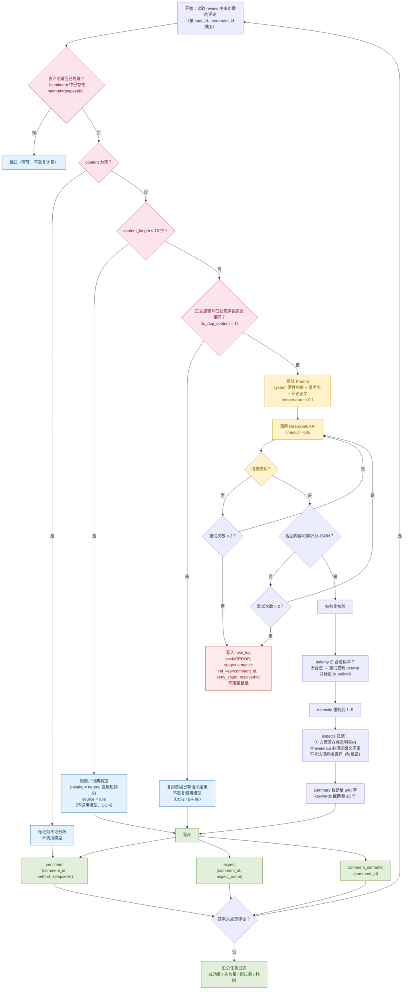
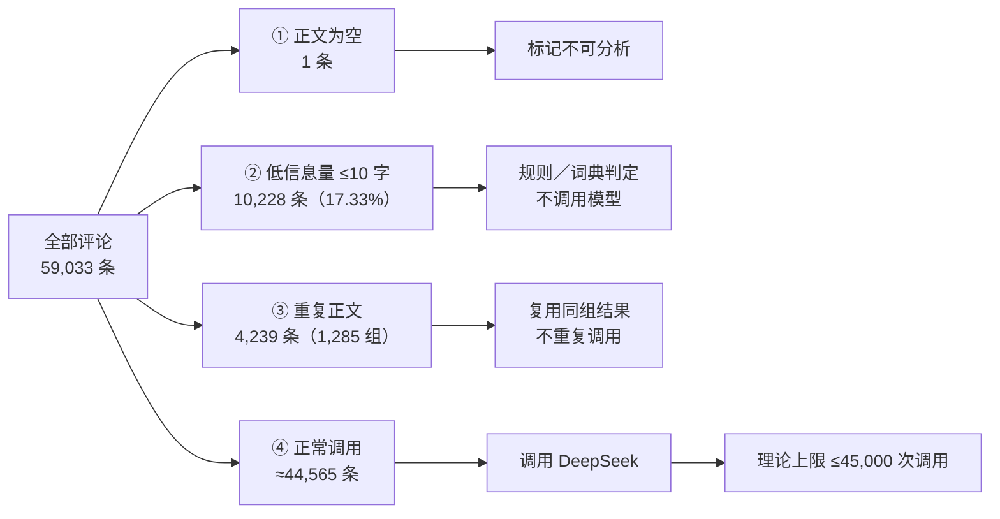
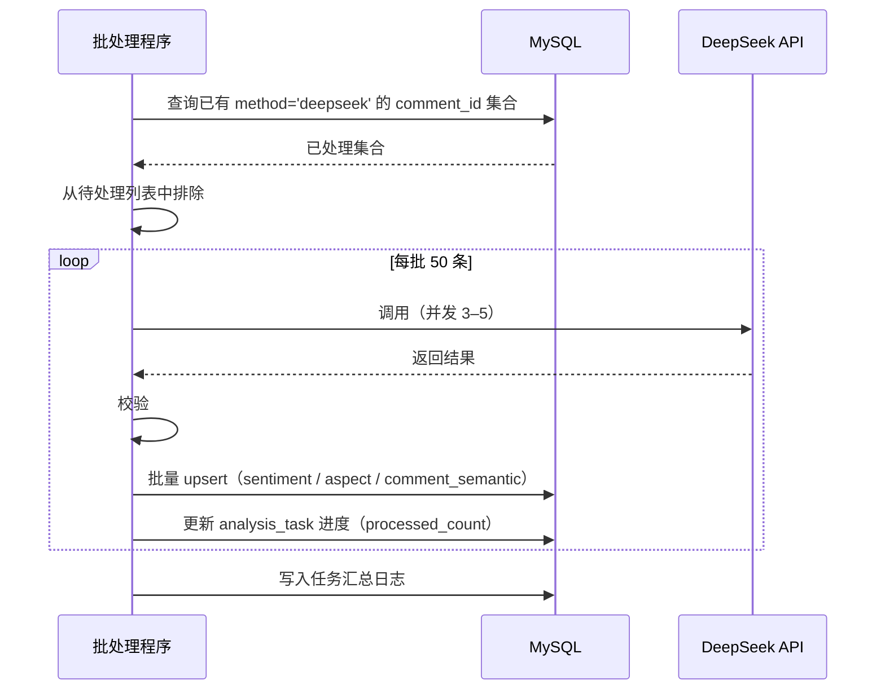

# DeepSeek 评论语义分析流程图

**项目名称**：基于 DeepSeek 的西藏旅游景点智能评价与分析系统
**文档版本**：V1.0
**编制日期**：2026-09-20
**配套文档**：`docs/design/详细设计说明书.md` §15.A、§7
**对应 C4 组件**：`C-BAT-04` 去重与分层、`C-BAT-05` 语义抽取；调用封装见 §7.2

---

## 1. 语义分析总流程



---

## 2. 分层与去重策略（成本控制核心）



| 层级 | 判定条件 | 条数 | 处理方式 | 节省调用 |
|---|---|---|---|---|
| ① | `content` 为空 | 1 | 标记不可分析 | 1 |
| ② | `content_length ≤ 10` | 10,228 | 规则／词典判定 | 10,228 |
| ③ | `is_dup_content = 1` | 4,239（组内只调 1 次） | 复用结果 | 约 3,200 |
| ④ | 其余 | 约 44,565 | 调用 DeepSeek | — |

---

## 3. 输入输出规范

### 3.1 输入（Prompt）

```
[system]
你是一个旅游评论语义分析器。只输出 JSON，不要输出任何其他文字。
【硬性约束】
1. 只能依据给定评论文本作答，不得使用你自身的知识补充。
2. 不得编造数字。
3. aspects 只能从候选方面列表中选取：
   风景 / 交通 / 门票 / 服务 / 设施 / 住宿餐饮 / 高原反应 / 人流拥挤 / 性价比 / 其他
4. 无法归入任何方面时，aspects 返回空数组。

[user]
景点：布达拉宫
评论：风景绝美，但是门票太贵了，而且人特别多。
```

### 3.2 输出（JSON）

```json
{
  "polarity": "negative",
  "intensity": 4,
  "aspects": [
    { "aspect": "风景", "polarity": "positive", "evidence": "风景绝美" },
    { "aspect": "门票", "polarity": "negative", "evidence": "门票太贵了" },
    { "aspect": "人流拥挤", "polarity": "negative", "evidence": "人特别多" }
  ],
  "keywords": ["风景", "门票", "人多"],
  "summary": "风景很美但门票偏贵且人流拥挤"
}
```

### 3.3 校验规则

| # | 校验项 | 不通过处理 |
|---|---|---|
| 1 | 可解析为 JSON | 重试 2 次 → 失败入队 |
| 2 | `polarity` 枚举合法 | 重试 → 判 `neutral` 并标记 `is_valid=0` |
| 3 | `intensity` 为 1–5 整数 | 钳制到区间 |
| 4 | `aspect` 属候选列表 | **丢弃该项** |
| 5 | **`evidence` 必须是评论原文子串** | **丢弃该项**（防止模型编造依据） |
| 6 | `summary` ≤40 字、`keywords` ≤5 个 | 截断 |

> **第 5 条是关键**：`evidence` 若无法在原文中定位，说明模型在编造依据，该方面直接弃用。这是"数据负责事实"在单条评论粒度的落地。

### 3.4 入库

| 目标表 | 字段 | 幂等键 |
|---|---|---|
| `sentiment` | `comment_id, spot_id, method='deepseek', polarity, intensity, is_valid, raw_json` | `(comment_id, method)` |
| `aspect` | `comment_id, spot_id, aspect_name, polarity, evidence` | `(comment_id, aspect_name)` |
| `comment_semantic` | `comment_id, spot_id, keywords, summary, source` | `comment_id` |

---

## 4. 异常处理

| 异常 | 处理 | 影响 |
|---|---|---|
| 网络超时 | 重试 2 次（间隔 2s／5s） | 无 |
| 返回非 JSON | 重试；仍失败写入 `task_log`（`level=ERROR`，`stage=semantic`，`ref_key=comment_id`） | 该评论情感字段留空 |
| `aspects` 全部被丢弃 | 保留 `polarity`／`intensity`，不写 `aspect` | 该评论不参与方面统计 |
| 限流（429） | 降低并发、增加间隔后重试 | 批处理变慢 |
| 批量中断 | 断点续跑，从最后成功的 `comment_id` 继续 | 无重复计费 |
| 部分失败 | 记录到 `task_log`（`retry_count`／`resolved` 便于筛选补跑），**继续处理其余评论** | 不阻塞整批 |

---

## 5. 幂等与断点续跑



**断点键**：`comment_id`。中断后重跑，已处理记录自动跳过，**不产生重复调用与重复计费**。

---

**文档结束**
