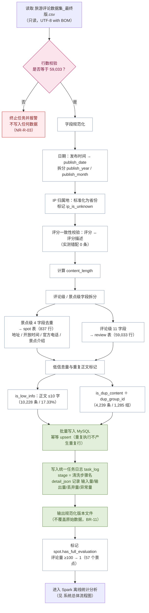

# 评论数据处理流程图

**项目名称**：基于 DeepSeek 的西藏旅游景点智能评价与分析系统
**文档版本**：V1.0
**编制日期**：2026-09-20
**配套文档**：`docs/design/详细设计说明书.md` §4.7、§8
**对应 C4 组件**：`C-BAT-01` 任务编排、`C-BAT-02` 数据校验、`C-BAT-03` 清洗与规范化、`C-BAT-04` 去重与分层、`C-SPK-01`～`C-SPK-05`

---

## 1. 评论数据处理总流程

---

## 2. 处理步骤明细

| 步骤 | 处理内容 | 规则依据 | 实测结果 |
|---|---|---|---|
| 1 | 行数校验 | NR-R-03：必须等于 59,033 | 通过（59,033 行） |
| 2 | 日期规范化 | 格式统一 `YYYY-MM-DD` | 异常 0 条 |
| 3 | IP 归属地标准化 | 取省份；保留原值便于溯源 | 66 种取值；2022-08 前 100% 为"未知" |
| 4 | 评分一致性校验 | 评分与评分描述须一一对应 | 错配 0 条；评分空值 37 条 |
| 5 | 正文长度计算 | `content_length` | 中位数 31 字，最长 1,829 字 |
| 6 | 评论级／景点级拆分 | BR-09：景点级字段不作分析维度 | `spot` 837 行；`review` 59,033 行 |
| 7 | 低信息量标记 | BR-05：正文 ≤10 字 | 10,228 条（17.33%） |
| 8 | 重复正文标记 | BR-06：1,285 组 | 4,239 条（7.18%），跨景点 759 组 |
| 9 | 批量写入 | 幂等 upsert | `comment_id` 为幂等键 |
| 10 | 清洗步骤统计 | 每步处理量可复核 | 写入 `task_log`（`stage`=步骤名，四类计数入 `detail_json`） |
| 11 | 输出规范文件 | BR-11：不覆盖原始数据 | 输出带版本号的新文件 |
| 12 | 评价资格标记 | BR-02：评论量 ≥100 | 57 个景点为 1 |

---

## 3. 关键设计点

| # | 设计点 | 说明 |
|---|---|---|
| 1 | **行数校验前置且强制** | 校验不通过直接终止，避免脏数据污染数据库（NR-R-03） |
| 2 | **景点级字段必须拆分** | 4 个景点级字段在同一景点内完全重复，留在评论表会造成冗余并易被误当特征（BR-09） |
| 3 | **空值如实保留** | 37 条缺评分、1 条缺正文、官方电话仅 99/837 有值——**缺失即 NULL，不填补、不造数** |
| 4 | **图片URL为空是业务含义** | 30,493 条为空表示该评论无图，不是数据缺失；前端显示"无图片"而非"缺失" |
| 5 | **标记而非删除** | 低信息量与重复正文**保留在库**，仅打标记：统计类功能用全量，文本建模类按标记过滤（双口径） |
| 6 | **幂等写入** | 以 `comment_id` 为键 upsert，重跑不产生重复行，支持断点续跑（NR-R-01／02） |
| 7 | **不覆盖原始数据** | 清洗结果另存新版本文件（BR-11） |

---

## 4. 异常处理

| 异常 | 处理 |
|---|---|
| 行数不符 | 终止任务，不写入任何数据，记录错误并报警 |
| 字段缺失（评分／正文） | 允许为空，如实入库；统计时按"未判定"单列 |
| 日期格式异常 | 记录异常并跳过该条语义分析（保留评论基础信息） |
| 编码异常 | 读取时按 UTF-8 with BOM 处理；异常行数记入 `task_log.detail_json.abnormal_count` |
| 写入中断 | 断点续跑：从最后成功的 `comment_id` 之后继续 |

---

**文档结束**
