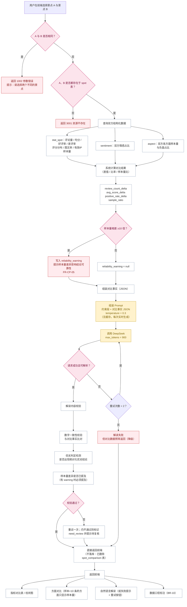

# 景点对比流程图

**项目名称**：基于 DeepSeek 的西藏旅游景点智能评价与分析系统
**文档版本**：V1.0
**编制日期**：2026-09-20
**配套文档**：`docs/design/详细设计说明书.md` §15.D
**对应 C4 组件**：`C-API-10` 景点对比组件、`C-API-04` 数据统计组件、`C-API-07` 方面分析组件、`C-API-12` DeepSeek 调用组件

---

## 1. 景点对比流程



---

## 2. 对比事实结构（系统计算，模型只解释）

```json
{
  "spot_a": { "id": 1, "name": "布达拉宫", "review_count": 3965, "avg_score": 4.62,
              "positive_rate": 0.86, "negative_rate": 0.07,
              "sentiment": { "positive": 0.78, "neutral": 0.13, "negative": 0.09 } },
  "spot_b": { "id": 3, "name": "纳木措景区", "review_count": 3057, "avg_score": 4.55,
              "positive_rate": 0.81, "negative_rate": 0.11,
              "sentiment": { "positive": 0.71, "neutral": 0.16, "negative": 0.13 } },
  "diff": {
    "review_count_delta": -908,
    "avg_score_delta": -0.07,
    "positive_rate_delta": -0.05,
    "sample_ratio": 1.30,
    "reliability_warning": null
  },
  "aspects": [
    { "aspect": "风景", "a": { "sample_size": 1820, "negative_rate": 0.03 },
                        "b": { "sample_size": 1510, "negative_rate": 0.05 } },
    { "aspect": "门票", "a": { "sample_size": 640, "negative_rate": 0.41 },
                        "b": { "sample_size": 220, "negative_rate": 0.18 } }
  ],
  "caliber": { "ip_valid_since": "2022-08-01", "aspect_min_sample": 10 }
}
```

> **差值、比率、样本量比全部由后端计算**，模型只负责把已算出的事实写成自然语言。这是"数据负责事实，DeepSeek 负责解释"在对比功能上的体现。

---

## 3. 解读 Prompt 约束

```
[system]
你是旅游景点评论数据的对比解读撰写者。你只能使用"对比事实"中给出的数据作答。
【硬性约束】
1. 不得使用你自身的知识补充事实。
2. 引用数字必须与对比事实完全一致。
3. 必须先陈述数据差异，再解释可能的原因。
4. 不得判定"哪个更好"或给出推荐结论，只说明数据反映的差异。
5. 若对比事实中包含 reliability_warning，必须在解读中提及样本量差异对结论可靠性的影响。
6. 输出 JSON：{ "interpretation": "..." }
```

---

## 4. 缓存设计（按精简要求：不缓存）

| 项 | 设计 |
|---|---|
| 是否缓存 | **不缓存**。已删除 `spot_comparison` 表 |
| 对比指标 | 由后端**实时查询** `stat_spot`／`sentiment`／`aspect` 计算，本身不依赖模型 |
| 对比解读 | 每次请求实时调用 DeepSeek 生成，**直接返回前端**，不落库 |
| 不缓存的理由 | 该内容约 900 tokens、属用户主动触发的低频操作；景点对组合随机性大、真实重复率低，缓存收益有限。成本控制的关键在 `spot_report` 的离线预生成（57 个景点必然被反复查看） |
| 后续评估 | 若实测发现热门景点对被频繁对比导致调用量偏高，再评估恢复缓存表（届时需同步更新数据库设计文档） |

---

## 5. 异常与降级

| 异常 | 处理 | 用户可见 |
|---|---|---|
| A 与 B 相同 | 不查询、不调用模型 | "请选择两个不同的景点" |
| 景点不存在 | 返回 3001 | "景点不存在，请重新选择" |
| 任一方评论量极少（如 1 条） | **仍返回可算出的指标**，但对比事实带 `reliability_warning` | 解读中提示样本差异；图表标注样本量 |
| 某方面任一方样本 <10 条 | 该方面只显示样本量，不出结论 | 图表中置灰并标注"样本不足" |
| DeepSeek 调用失败 | 仍返回完整指标与方面对比，解读位置显示失败提示与重试按钮 | 数据不缺失 |
| 解读出现绝对优劣结论 | 校验拦截，重试一次；仍出现则标记待复核 | 标注"该解读待人工复核" |
| 解读数字与事实不符 | 校验拦截并标记 | 同上 |

> **降级原则**：对比功能的**数据部分不依赖模型**，因此模型不可用时功能仍然可用（仅缺少自然语言解读）。这与"智能评价"必须依赖模型不同。

---

**文档结束**
