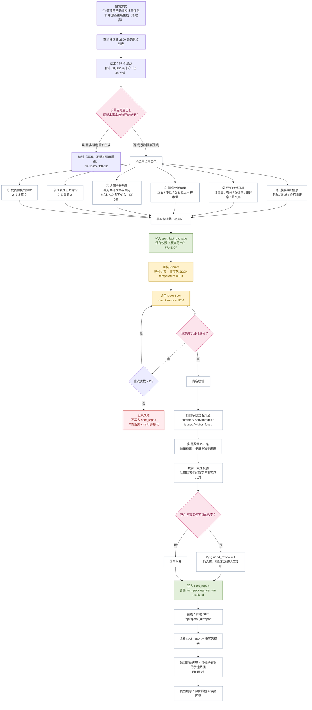
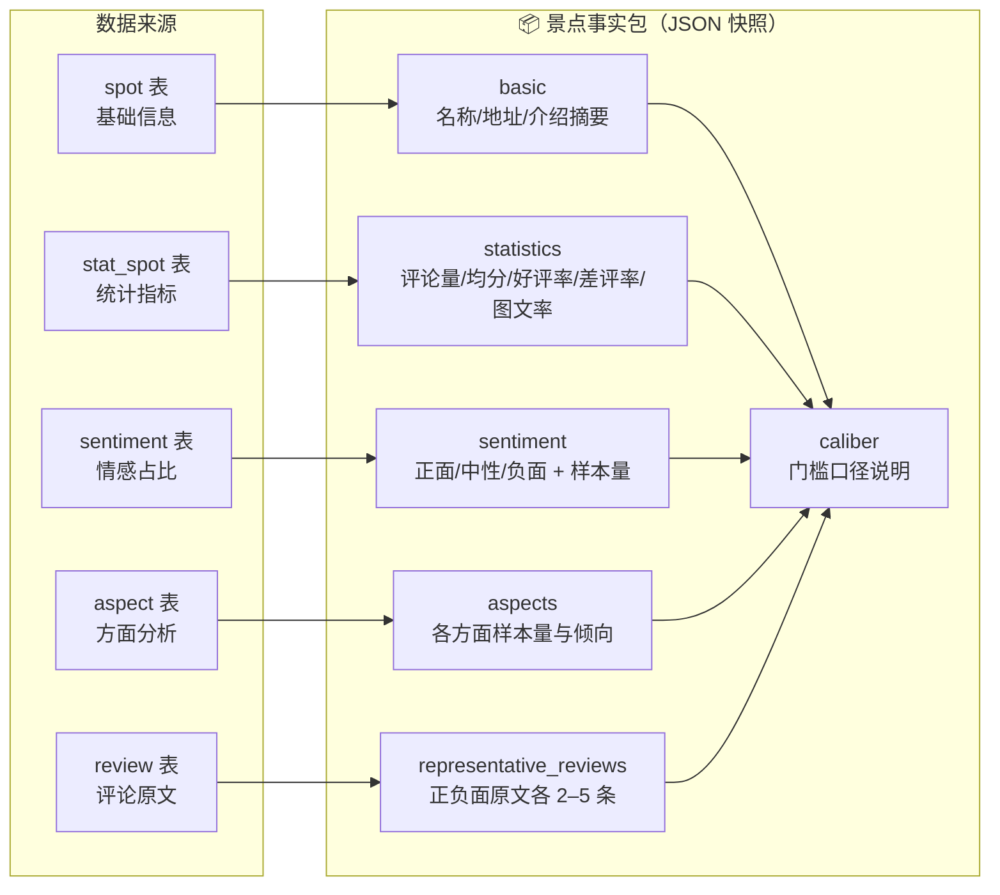
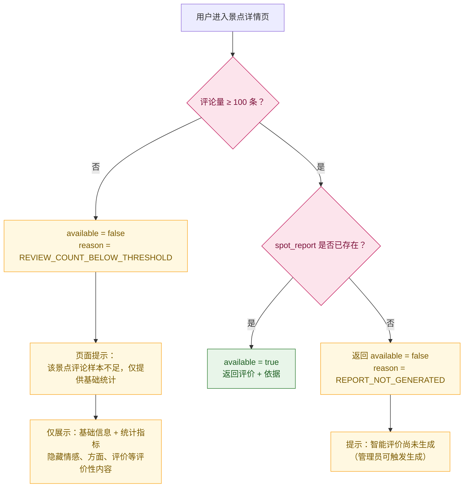

# 景点智能评价流程图

**项目名称**：基于 DeepSeek 的西藏旅游景点智能评价与分析系统
**文档版本**：V1.0
**编制日期**：2026-09-20
**配套文档**：`docs/design/详细设计说明书.md` §15.B、§15.C
**对应 C4 组件**：`C-BAT-06` 事实包构造、`C-BAT-07` 评价生成、`C-API-09` 智能评价组件

---

## 1. 总体流程（离线生成 + 在线读取）



---

## 2. 事实包组成（唯一的评价依据）



### 代表性评论筛选规则

| 顺序 | 规则 |
|---|---|
| 1 | 排除低信息量（正文 ≤10 字） |
| 2 | **优先选取非重复正文**（避免"值得一去"这类撞车短句） |
| 3 | 按点赞数降序；正文长度 30–200 字优先 |
| 4 | 正面取 `score ≥4`、负面取 `score ≤2` |
| 5 | 各取 2–5 条；**负面不足则如实留少，不凑数** |

---

## 3. Prompt 约束（BR-07 的实现）

```
[system]
你是旅游景点评论分析报告的撰写者。你只能使用"事实数据"中给出的信息撰写报告。
【硬性约束】
1. 不得使用你自身的知识补充任何事实。
2. 引用数字必须与事实数据完全一致，不得四舍五入后改变量级。
3. 事实数据中未涉及的方面，不要提及。
4. 不得给出绝对的推荐结论，只陈述数据反映的情况。
5. 输出 JSON，字段为 summary / advantages / issues / visitor_focus。
```

---

## 4. 门槛与降级（重要）



| 情况 | 系统行为 | 对应需求 |
|---|---|---|
| 评论量 ≥100 且已有报告 | 展示完整评价 ＋ 依据数据 | FR-IE-03、FR-IE-06 |
| 评论量 ≥100 但未生成 | `available=false`，提示尚未生成 | FR-IE-09 |
| 评论量 <100 | `available=false`，只提供基础统计并提示样本不足 | BR-02、BR-03、FR-SA-09 |
| 方面样本 <10 条 | 该方面不纳入事实包，不参与评价 | BR-04 |
| 数字校验不通过 | 入库但标记 `need_review=1`，前端标注"待人工复核" | FR-IE-04 的强制关卡 |
| 生成失败 | 不写库，保持不可用并提示，保留历史结果 | FR-IE-09、NR-R-05 |

---

## 5. 可追溯链

```
spot_report（评价文本）
   ├─ fact_package_version ──▶ spot_fact_package.package_json（当时的数字快照）
   │                              ├─ statistics（评论量/均分/好评率…）
   │                              ├─ sentiment（占比 + 样本量）
   │                              ├─ aspects（各方面样本量）
   │                              └─ representative_reviews（comment_id 列表）
   │                                     └─▶ review.content（原文）
   ├─ model（如 deepseek-chat）
   ├─ prompt_version（Prompt 模板版本）
   ├─ generated_at（生成时间）
   └─ task_id ──▶ analysis_task（哪次任务产生的）
```

**能回答的三个问题**：① 这段评价依据了哪些数据；② 数据何时、由哪次任务算出；③ 用的是哪版事实包与模型。这是 FR-IE-06／07 的完整实现。

---

**文档结束**
