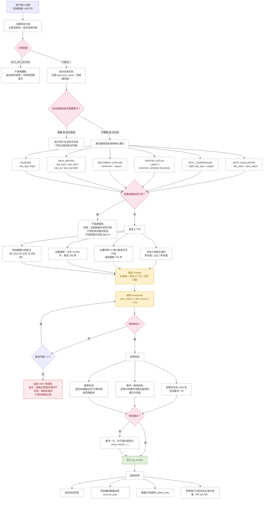
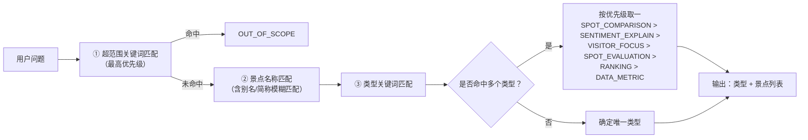

# 智能问答流程图

**项目名称**：基于 DeepSeek 的西藏旅游景点智能评价与分析系统
**文档版本**：V1.0
**编制日期**：2026-09-20
**配套文档**：`docs/design/详细设计说明书.md` §15.E
**对应 C4 组件**：`C-API-11` 智能问答组件、`C-API-12` DeepSeek 调用组件、`C-API-13` 数据访问组件

> **本功能不是通用聊天机器人**：系统不允许模型凭自身知识作答。三条硬约束保证这一点——① 问题必须先分类，超范围**直接拒答且不调用模型**；② 检索不到事实时**不调用模型**，直接说明无数据；③ 上下文只包含数据库中已完成的结构化分析结果。

---

## 1. 智能问答主流程

---

## 2. 问题分类规则

### 2.1 六类可回答问题 + 一类拒答

| 类型码 | 类型 | 判定关键词示例 | 检索的数据 | 是否需景点 |
|---|---|---|---|---|
| `SPOT_EVALUATION` | 景点评价咨询 | 怎么样／值得去／好不好／评价／口碑 | `stat_spot`、`spot_report` | 是 |
| `SPOT_COMPARISON` | 景点差异对比 | 和…比／哪个好／区别／对比／vs | 双方 `stat_spot`、`aspect` | 是（两个） |
| `VISITOR_FOCUS` | 游客主要关注点 | 关注什么／在意什么／最关心／吐槽什么 | `aspect`、`comment_semantic.keywords` | 否（可全局或指定景点） |
| `SENTIMENT_EXPLAIN` | 情感／方面解释 | 为什么差评／情感分布／负面评价在哪方面 | `sentiment`、`aspect` | 是 |
| `DATA_METRIC` | 系统数据指标查询 | 多少条／占比／平均分／客源地／时间分布 | `stat_spot`、`stat_time`、`stat_ip`、`stat_overview` | 否 |
| `RANKING` | 景点排行相关 | 排名／前十／最多／最高／最好 | `stat_spot` TopN | 否 |
| `OUT_OF_SCOPE` | 超范围（拒答） | 路线／行程／几天／天气／酒店／住宿／订票／门票预订／交通怎么走 | — | — |

### 2.2 分类实现方式

> **超范围判定优先级最高**：即使问题中出现景点名，只要包含"路线""订票"等超范围意图，一律拒答。这避免了"假装回答了但内容越界"。

---

## 3. 上下文组装规则（CC-3 的实现）

| 规则 | 说明 |
|---|---|
| **只传结构化事实** | 传入聚合值、占比、样本量与必要的少量代表性评论片段；**绝不传原始评论全集** |
| 评论片段限制 | 最多 3 条，每条截断 120 字，优先非重复正文 |
| 量级上限 | 单次上下文文字 ≤3,000 字，事实条目 ≤30 条 |
| 必带口径 | 客源地类问题必须附"仅统计 2022-08 之后的 35,098 条有效样本" |
| 标注来源 | 每段事实标注来自哪张表，便于回答中说明依据并写入 `sources_json` |

**与"发送原始评论给大模型"的对比**：

| 方式 | 单次输入量 | 成本 | 是否采用 |
|---|---|---|---|
| 发送全部相关原始评论 | 单景点可达 3,965 条（数十万字） | 极高，且可能超出上下文上限 | ❌ |
| **只发检索到的结构化事实** | 约 1–3 千字 | 低，可控 | ✅ |

---

## 4. 问答示例

| 用户问题 | 分类 | 系统行为 | 结果 |
|---|---|---|---|
| "布达拉宫值得去吗" | SPOT_EVALUATION | 检索 `stat_spot` + `spot_report` | 生成回答，附评论量与样本量 |
| "布达拉宫和纳木措哪个门票问题更严重" | SPOT_COMPARISON | 检索双方门票方面数据 | 生成对比回答 |
| "游客最在意西藏景点的什么" | VISITOR_FOCUS | 检索全局方面分布 | 生成回答，列出主要关注点及占比 |
| "为什么布达拉宫差评集中在哪些方面" | SENTIMENT_EXPLAIN | 检索方面负面占比 | 生成回答 |
| "一共采集了多少条评论" | DATA_METRIC | 直接检索 `stat_overview` | 回答 59,033 条 |
| "评论量前十的景点" | RANKING | 检索 `stat_spot` Top10 | 列出排行 |
| "帮我规划一条西藏 7 日游路线" | OUT_OF_SCOPE | **不检索、不调用模型** | 拒答并说明可回答范围 |
| "明天拉萨天气怎么样" | OUT_OF_SCOPE | **不检索、不调用模型** | 拒答 |
| "帮我订布达拉宫的门票" | OUT_OF_SCOPE | **不检索、不调用模型** | 拒答 |
| "布达拉宫周边有什么好吃的" | OUT_OF_SCOPE 或 VISITOR_FOCUS | 若无住宿餐饮方面数据则归为超范围 | 依据数据情况回答或拒答 |

---

## 5. 历史记录设计

| 项 | 设计 |
|---|---|
| 保存内容 | `question`、`question_type`、`spot_ids`、`answer`、`sources_json`、`caliber_note`、`created_at` |
| 游客 | `user_id` 为 NULL，仅当次可用，**不提供历史查询** |
| 登录用户 | 按 `user_id` 查询自己的历史，接口强制以当前会话用户过滤（防越权） |
| **不做多轮上下文** | 不保存对话状态、不做指代消解；每次提问独立处理（FR-QA-08 明确"不做复杂的长期上下文记忆"） |
| 分页 | `GET /api/qa/history?page=&page_size=`，默认按时间倒序 |

---

## 6. 异常与边界处理

| 情况 | 处理 | 用户可见 |
|---|---|---|
| 空问题或超长（>200 字） | 返回 1001／1002 | "请输入有效问题（不超过 200 字）" |
| 问题提及的景点不存在 | 提示并给出相似景点候选 | "未找到该景点，您是否想查询：…" |
| 需要景点但未识别到 | 不检索、不调用模型 | "请在问题中说明具体景点名称" |
| 检索结果为空 | 不调用模型 | "当前数据中没有可用于回答该问题的信息" |
| 问题超范围 | 不检索、不调用模型 | 拒答 + 可回答的六类范围说明 |
| 模型调用失败 | 重试 2 次后返回 4001 | "智能问答服务暂时不可用，请稍后重试"（提供重试按钮） |
| 回答数字与事实不符 | 重试一次；仍不符则标记 `need_review=1` | 标注"该回答待人工复核" |
| 回答越界（承诺超范围服务） | 校验拦截，替换为能力边界说明 | 明确边界 |

---

**文档结束**
