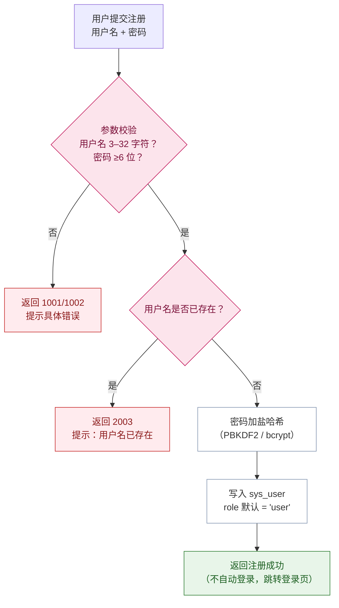
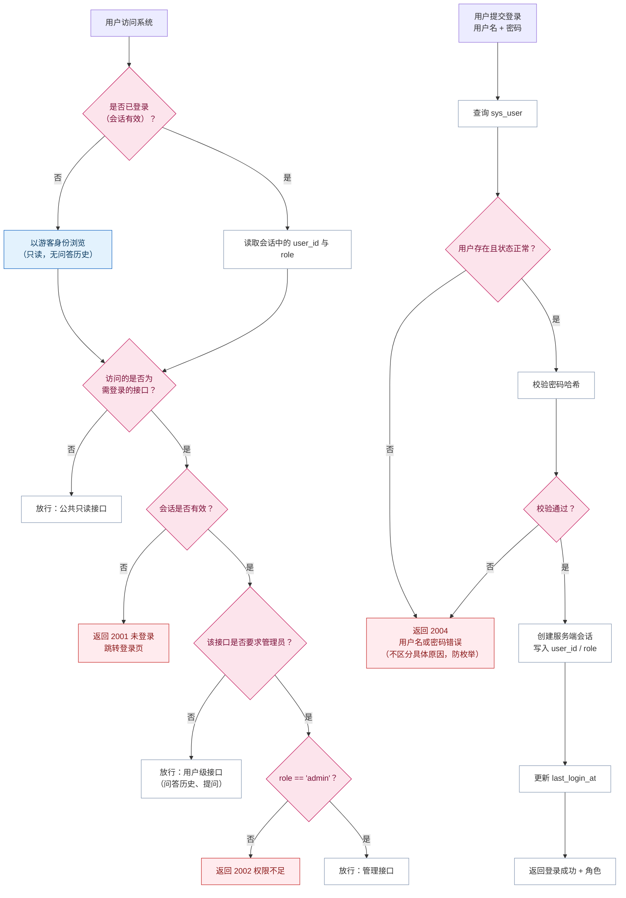
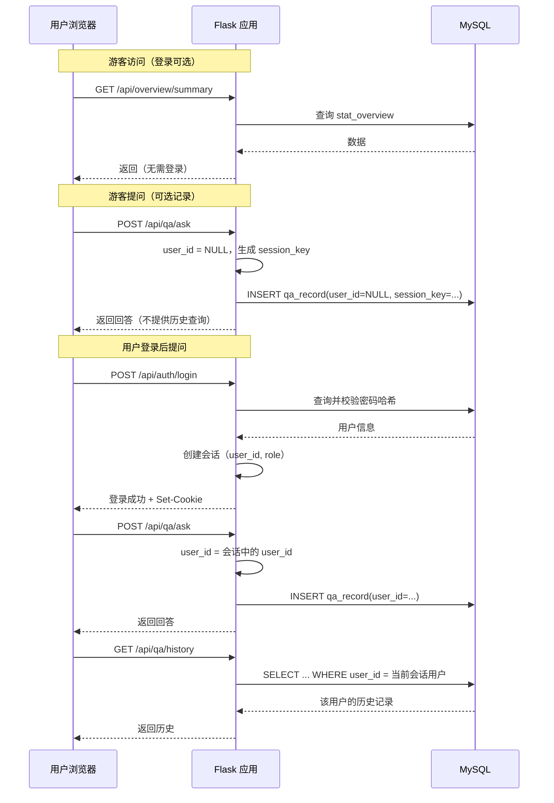

# 用户登录与权限流程图

**项目名称**：基于 DeepSeek 的西藏旅游景点智能评价与分析系统
**文档版本**：V1.0
**编制日期**：2026-09-20
**配套文档**：`docs/design/详细设计说明书.md` §13
**对应 C4 组件**：`C-API-01` 用户认证组件、`C-API-14` 管理组件
**对应需求**：FR-SY-01、FR-SY-02、NR-S-01、NR-S-02

---

## 1. 注册流程

---

## 2. 登录与权限校验流程

---

## 3. 角色与权限矩阵

| 功能 | 游客（未登录） | 普通用户（user） | 管理员（admin） |
|---|---|---|---|
| 数据总览 | ✅ | ✅ | ✅ |
| 景点分析（详情／情感／方面／主题） | ✅ | ✅ | ✅ |
| 景点智能评价（查看） | ✅ | ✅ | ✅ |
| 景点对比 | ✅ | ✅ | ✅ |
| 智能问答（提问） | ✅ | ✅ | ✅ |
| 问答历史查看 | ❌ | ✅ | ✅ |
| 智能评价重新生成 | ❌ | ❌ | ✅ |
| 触发／监控离线任务 | ❌ | ❌ | ✅ |
| 任务日志查询 | ❌ | ❌ | ✅ |
| 用户管理 | ❌ | ❌ | ✅ |
| 数据口径配置查看 | ❌ | ❌ | ✅ |

**权限模型说明（从简）**：

- 仅区分上述三类角色，用 `sys_user.role` 单字段表达；
- **不建权限表、不做菜单级权限、不做细粒度数据权限、不做单点登录**（业务需求范围外事项第 12 项）；
- 管理员权限与普通用户权限为**并列**关系，不是继承关系（业务需求 §4.1）。

---

## 4. 安全设计要点

| # | 要点 | 说明 | 对应需求 |
|---|---|---|---|
| 1 | 密码加盐哈希存储 | 禁止明文；使用 PBKDF2／bcrypt | NR-S-01 |
| 2 | 登录失败不区分原因 | 统一提示"用户名或密码错误"，防止用户名枚举 | — |
| 3 | 会话管理 | 登录写入服务端会话；注销即失效；不实现"记住我"长期令牌 | — |
| 4 | 接口级鉴权 | 需登录接口校验会话；管理接口额外校验角色 | NR-S-02 |
| 5 | **越权防护（重点）** | 问答历史查询**强制以当前会话 `user_id` 过滤**，不接受前端传入他人 ID | — |
| 6 | SQL 注入防护 | 全部使用参数化查询 | NR-S-03 |
| 7 | 错误信息克制 | 不向前端返回堆栈或 SQL 语句 | NR-S-03 延伸 |
| 8 | 口令强度 | 注册时校验最小长度（≥6 位）；不做复杂度强制，避免影响演示 | — |

---

## 5. 会话与游客标识

---

## 6. 注销流程

| 步骤 | 动作 |
|---|---|
| 1 | 前端调用 `POST /api/auth/logout` |
| 2 | 服务端销毁会话 |
| 3 | 前端跳转首页，回到游客态 |
| 4 | 已保存的问答记录**保留**（属于历史数据，不随注销删除） |

---

**文档结束**
