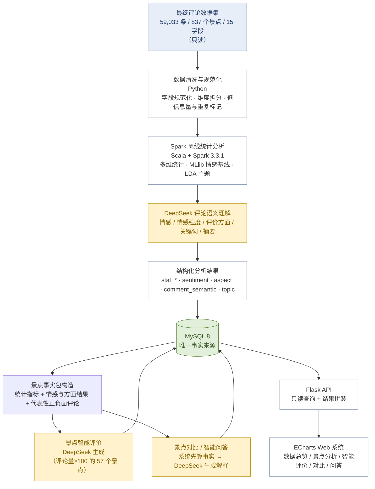

# 系统总体流程图

**项目名称**：基于 DeepSeek 的西藏旅游景点智能评价与分析系统
**文档版本**：V1.0
**编制日期**：2026-09-20
**配套文档**：`docs/architecture/C4容器图.md`、`docs/design/详细设计说明书.md`
**说明**：本图与开题报告"实施方案"一节一致，可按本图直接绘制成论文用图。

---

## 1. 系统总体流程图

**图注**：图 1　系统总体流程图
**图下注解**：数据负责事实，DeepSeek 负责语义理解与自然语言解释。

---

## 2. 流程说明

| 步骤 | 环节 | 技术 | 输入 | 输出 | 是否调用大模型 |
|---|---|---|---|---|---|
| 1 | 读取数据集 | 文件读取 | CSV 59,033 条 | 内存数据 | 否 |
| 2 | 数据清洗与规范化 | Python | 原始 CSV | `spot`、`review`、`task_log`（步骤统计） | 否 |
| 3 | 离线统计分析 | Scala + Spark | `review` | `stat_spot`、`stat_time`、`stat_ip`、`topic`、`sentiment(mllib)`、`analysis_task`（模型指标） | 否 |
| 4 | 评论语义理解 | Python + DeepSeek | 评论正文 | `sentiment(deepseek)`、`aspect`、`comment_semantic` | **是（批量）** |
| 5 | 结构化结果入库 | JDBC | 上述结果 | MySQL | 否 |
| 6 | 事实包构造 | Python | 统计＋语义结果 | `spot_fact_package` 快照 | 否 |
| 7 | 景点智能评价生成 | Python + DeepSeek | 事实包 | `spot_report` | **是（批量）** |
| 8 | 景点对比 / 智能问答 | Flask + DeepSeek | 用户请求 ＋ 已落库事实 | 对比：**直接返回不落库**；问答：`qa_record` | **是（在线）** |
| 9 | 接口查询 | Flask | 查询参数 | JSON | 否 |
| 10 | 前端展示 | ECharts | JSON | 图表与页面 | 否 |

---

## 3. 两条链路的分界

| 维度 | 离线链路（步骤 1–7） | 在线链路（步骤 8–10） |
|---|---|---|
| 触发 | 手动／脚本执行（管理员） | 用户点击 |
| 耗时 | 分钟–小时级 | 秒级（问答 ≤20 秒） |
| 大模型调用 | 批量、可分批、可断点续跑 | 每次请求调用（仅问答与对比） |
| 结果 | 全部落库 | 落库并可复用 |
| 失败影响 | 可重跑，不影响演示 | 有明确提示与降级 |

---

## 4. 与 C4 容器图的对应

| 本图步骤 | C4 容器 | C4 组件 |
|---|---|---|
| 1–2 | Python 批处理服务 | `C-BAT-01`～`C-BAT-04` |
| 3 | Spark 离线分析 | `C-SPK-01`～`C-SPK-05` |
| 4–5 | Python 批处理服务 | `C-BAT-05` |
| 6 | Python 批处理服务 | `C-BAT-06` |
| 7 | Python 批处理服务 | `C-BAT-07` |
| 8 | Flask Web 应用 | `C-API-10`、`C-API-11`、`C-API-12` |
| 9 | Flask Web 应用 | `C-API-02`～`C-API-09`、`C-API-13` |
| 10 | Web 前端 | — |

---

**文档结束**
