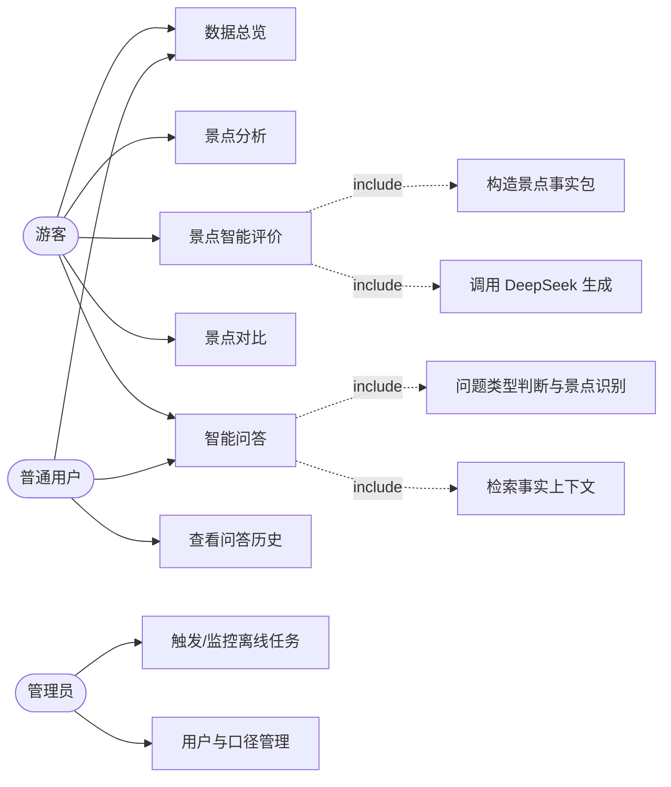

# 业务需求文档（BRD）

**项目名称**：基于 DeepSeek 的西藏旅游景点智能评价与分析系统
**文档版本**：V1.1
**编写日期**：2026-09-20
**对应阶段**：开题阶段 — 需求分析
**上游依据**：`开题/NIIT-GUET-2023-Class-2316030201-开题报告.docx`、`项目现状分析.md`、`数据采集/最终数据质量报告.md`、`数据采集/采集工作报告.md`
**下游用途**：系统设计（C4 架构视图）、详细设计说明书、数据库设计、系统测试验收

> 说明：本文档遵循"文档先行"流程，是后续设计与验收的**基准文档**。**凡本文档未列出的功能，原则上不实现**；如需增加，须先更新本文档并确认。文中所有数据规模、字段结构、质量结论均来自对最终数据集的全量核验，未使用估算值。

---

## 目录

1. 引言
2. 项目概述
3. 数据需求
4. 用户角色与用例
5. 功能需求
6. 非功能需求
7. 业务规则汇总
8. 需求追溯矩阵
9. 范围外事项（明确不做）
10. 附录

---

## 1. 引言

### 1.1 编写目的

本文档定义"基于 DeepSeek 的西藏旅游景点智能评价与分析系统"的业务需求，明确系统边界、数据口径、用户角色、功能清单与非功能指标，作为后续系统设计、数据库设计、编码实现与测试验收的统一依据。

### 1.2 项目背景

本课题的数据采集阶段已完成：以携程平台公开点评数据为基础，采集并整理了**西藏及进藏沿线（川藏／滇藏／青藏线）旅游景点评论数据集**，共 **59,033 条评论、837 个景点、15 个字段**，并已完成清洗、去重、质量检查与报告整理。数据规模与质量已获指导教师认可。

数据条件具备后，本课题的工作重心从"取数"转向"用数"：需要对评论数据进行离线统计分析，并借助 DeepSeek 完成评论语义理解、景点智能评价、景点对比解释与限定范围内的智能问答，最终形成一个可交付、可演示的评价与分析系统。

### 1.3 系统定位

本系统**不是**单纯的数据可视化平台，**也不是**通用的对话机器人，而是：

> **基于旅游评论数据进行离线分析，并利用 DeepSeek 进行评论语义理解、景点智能评价、景点对比解释和限定范围内智能问答的旅游景点评价与分析系统。**

系统贯彻一条核心原则：

> **数据负责事实，DeepSeek 负责语义理解与自然语言解释。**

即：所有统计口径、对比指标、排名结果均由系统按既定规则计算得出；DeepSeek 只负责把评论语义结构化、把已算出的事实组织成自然语言。**禁止让模型凭常识或想象生成数据结论。**

### 1.4 术语与缩略语

| 术语 | 说明 |
|---|---|
| 数据集 | `数据采集/旅游评论数据集_最终版.csv`，59,033 条 / 837 景点 / 15 字段 |
| 事实包 | 系统按固定模板汇总的景点"数据事实集合"（统计指标＋情感与方面结果＋代表性正负面评论），是 DeepSeek 生成景点评价的唯一依据 |
| 语义结果 | DeepSeek 对单条评论抽取的结构化结果：情感极性、情感强度、评价方面、关键词、一句话摘要 |
| 评价方面 | 评论针对的具体维度，如风景、交通、门票、服务、高原反应、住宿餐饮等 |
| 基线方法 | Spark MLlib 情感分类模型与情感词典法，作为 DeepSeek 的对比参照 |
| 有效 IP 样本 | 发布时间在 2022-08-01 及之后的评论（该日期前 IP 归属地字段 100% 为"未知"） |
| 完整智能评价 | 针对评论量 ≥100 条的景点生成的综合评价，含主要优势、主要问题、游客关注点 |
| 降级 | 数据量不足时，系统按既定规则减少或关闭相应功能并明确提示，而非输出不可靠结论 |

### 1.5 读者对象

指导教师、答辩评审、本人（开发与论文撰写）。本文档不面向终端游客。

---

## 2. 项目概述

### 2.1 建设目标

1. 完成 59,033 条评论的全量离线统计与规范化入库；
2. 完成评论的细粒度语义理解（情感、强度、方面、关键词、摘要）并结构化存储；
3. 基于统计结果与语义结果构造景点事实包，生成**有数据依据**的景点智能评价；
4. 提供两景点结构化对比，并由 DeepSeek 生成对比解释；
5. 提供限定在评论数据范围内的智能问答；
6. 通过 Web 系统完成上述结果的展示与交互。

### 2.2 系统边界

**系统包含**：

- 对已完成数据集的离线处理（清洗、统计、语义理解、评价生成）；
- 对处理结果的存储与查询；
- 面向用户的 5 个功能模块（数据总览、景点分析、景点智能评价、景点对比、智能问答）；
- 用户登录与权限管理。

**系统不包含**：

- 数据采集（上一阶段已完成，本系统不重采、不重爬）；
- 实时／流式数据处理（教师已明确不做）；
- 旅游路线规划、天气查询、酒店预订、票务等业务；
- 个性化推荐（数据中无用户标识与行为序列，不具备条件）；
- 移动端 App、小程序。

### 2.3 技术栈约束

| 环节 | 技术 | 说明 |
|---|---|---|
| 数据清洗与文本预处理 | Python（pandas、jieba） | 负责行级清洗、字段规范化、DeepSeek 调用 |
| 离线统计分析 | Scala 2.13.10 ＋ Spark 3.3.1（Spark SQL、MLlib） | 全量统计、情感基线模型、LDA 主题 |
| 语义理解与生成 | DeepSeek 官方 API | 批处理调用，结果落库 |
| 数据库 | MySQL 8（localhost:3306） | 结构化存储 |
| 后端 | Flask | 提供 REST 接口，只读数据库 |
| 前端 | HTML ＋ ECharts | 图表展示与交互 |
| 运行环境 | JDK 1.8、Windows、Spark `local[*]` | 单机运行 |

**技术栈红线**：不得引入 Flume、Kafka、Spark Streaming、Flink、Hadoop 集群、Hive、HBase、Redis、Docker、微服务、向量数据库、RAG、Agent 等本课题无实际实现计划的组件。

### 2.4 关键约束

| # | 约束 | 来源 |
|---|---|---|
| C1 | 数据为**静态历史评论快照**，无实时数据源 | 数据采集工作报告 |
| C2 | 评论量在景点间**极端长尾**，中位数仅 5 条 | 全量核验 |
| C3 | IP 归属地字段在 2022-08 之前**结构性缺失** | 全量核验 |
| C4 | 评分高度偏斜，5 星占 71.72% | 全量核验 |
| C5 | 评论正文短小，中位数 31 字，17.33% 为 **≤10 字** | 全量核验 |
| C6 | 存在 1,285 组正文完全相同的评论 | 内容重复清单.csv |
| C7 | 单机环境，无 GPU，DeepSeek 采用官方 API 按量计费 | 开题报告 |
| C8 | 本科毕业设计，功能规模须可控 | 开题报告 |

---

## 3. 数据需求

### 3.1 数据来源

| 项目 | 内容 |
|---|---|
| 唯一数据源 | `数据采集/旅游评论数据集_最终版.csv` |
| 数据来源平台 | 携程（m.ctrip.com / you.ctrip.com）公开景点点评数据 |
| 采集方式 | Python requests 调用公开评论接口，单线程、低频、未绕过任何安全措施 |
| 来源口径 | 西藏（554 个景点 / 31,752 条）＋ 进藏沿线（283 个景点 / 27,281 条） |
| 数据性质 | 历史评论静态快照，一次性采集完成 |
| 使用限制 | 仅用于本人毕业设计学术分析，不对外分发原始数据 |

**口径要求**：系统所有页面与文档**统一表述为"西藏及进藏沿线旅游景点评论数据集"**，不得简称为"西藏数据集"（否则与普达措、稻城亚丁等云贵川景点自相矛盾）。

### 3.2 数据规模（全量核验结果）

| 指标 | 数值 |
|---|---|
| 评论总条数 | **59,033** |
| 景点总数 | **837** |
| 字段总数 | **15** |
| 评论编号唯一率 | **100.0000%**（重复 ID 行数 0） |
| 独立用户昵称数 | 32,532 |
| IP 归属地取值种类 | 66 |
| 时间跨度 | 2015-06-19 ~ 2026-09-16 |
| 文件编码 | UTF-8 with BOM |

### 3.3 字段结构与数据性质

数据集 15 个字段分为两类，**系统设计与建模时必须区分处理**：

**（1）评论级字段（11 个，每行独立，可用于统计与建模）**

| 字段 | 类型 | 空值 | 说明 |
|---|---|---|---|
| 景点名称 | 文本 | 0 | 关联景点维表 |
| 评论编号 | 数值 | 0 | **全局唯一键**，去重与幂等写入依据 |
| 评分 | 整数 1–5 | 37 | 星级标签 |
| 评分描述 | 文本 | 37 | 1不佳／2一般／3不错／4满意／5超棒，与评分一一对应 |
| 评论内容 | 长文本 | 1 | 语义分析对象 |
| 发布时间 | 日期 | 0 | 格式统一 `YYYY-MM-DD` |
| IP归属地 | 文本 | 0 | 2022-08 前均为"未知" |
| 用户昵称 | 文本 | 0 | **非稳定用户 ID**，不可用于用户建模 |
| 点赞数 | 整数 | 0 | 非零占 18.35%，最大 588 |
| 图片数 | 整数 | 0 | 非零占 48.35%，最大 18 |
| 图片URL | 文本 | 30,493 | 空值表示该评论无图，非数据缺失 |

**（2）景点级字段（4 个，同景点内重复，必须拆为景点维表）**

| 字段 | 覆盖情况 | 说明 |
|---|---|---|
| 地址 | 837 / 837 景点 | 完整 |
| 景点介绍 | 738 / 837 景点 | 部分缺失 |
| 开放时间 | 546 / 837 景点 | 进藏沿线部分缺失 |
| 官方电话 | **仅 99 / 837 景点** | 大面积缺失 |

**设计约束**：景点级 4 字段**不得作为评论级特征参与建模**（会造成特征冗余与信息泄漏）；在系统中**仅作为"有则展示"的辅助信息**，不得作为分析维度。

### 3.4 数据质量结论（已核验）

| 检查项 | 结果 |
|---|---|
| 评论编号重复 | 0 条 |
| 日期格式异常 | 0 条 |
| 评分与评分描述错配 | 0 条 |
| 图片数与图片URL不一致 | 0 条 |
| 评分缺失 | 37 条（0.06%） |
| 评论内容缺失 | 1 条 |
| 正文完全相同的重复评论 | 1,285 组 / 4,239 条（7.18%），其中跨景点 759 组 |

**重复正文处理要求**：这些是**不同评论 ID、内容恰好相同的真实评论**（如"值得一去""景色不错"），原文一律保留、不做修改。系统须支持两种口径：

- **统计类功能**（评分分布、客源分布等）→ **保留全部数据**；
- **文本建模类功能**（主题建模、语义抽取）→ **支持剔除或复用**重复正文，避免少数短句主导结果。

### 3.5 分析口径（重要，必须硬编码）

| # | 口径 | 规则 |
|---|---|---|
| S1 | 客源地分析时间下限 | 仅统计 **发布时间 ≥ 2022-08-01** 的评论（有效样本 **35,098 条**，其中"未知"仅 520 条） |
| S2 | 完整智能评价门槛 | 仅对 **评论量 ≥ 100 条**的景点生成完整智能评价（**57 个景点**，合计 50,562 条，占 85.7%） |
| S3 | 基础统计门槛 | 评论量 **< 100 条**的景点**只展示基础统计**，不生成评价性结论 |
| S4 | 方面级结论门槛 | 某景点某评价方面的样本数 **< 10 条**时，**不展示该方面的结论性内容**，仅显示样本量 |
| S5 | 低信息量评论标记 | 正文长度 **≤10 字**的评论标记为低信息量（10,228 条，17.33%），默认不进入大模型调用 |
| S6 | 口径标注 | 所有受上述口径影响的数据，页面**必须显示口径说明与有效样本量** |

### 3.6 数据流需求

```
最终数据集(CSV)
   ↓ 读取（UTF-8 with BOM，multiLine + escape，行数校验必须 = 59,033）
Python 清洗与规范化
   ↓ 字段规范化、评论级/景点级拆分、低信息量与重复标记、清洗日志
MySQL（spot 景点维表 / review 评论明细表 / task_log 任务统一日志）
   ↓
Spark 离线统计（Scala）→ 统计指标、MLlib 情感基线、LDA 主题 → MySQL（模型指标记入 analysis_task）
   ↓
Python 调用 DeepSeek 批处理 → 语义结果结构化入库 → MySQL
   ↓
事实包构造 → DeepSeek 生成景点评价 / 对比解释 / 问答回答 → MySQL（对比解读直接返回前端，不落库）
   ↓
Flask 接口查询 MySQL → ECharts 前端展示
```

**数据完整性要求**：读入阶段必须校验记录数等于 59,033；各处理环节须写入任务日志，记录处理量、丢弃量、异常量，保证流程可重跑、可追溯。

### 3.7 API 调用成本控制方案（已确认）

DeepSeek 官方 API 按量计费，本课题须在开发阶段主动控制调用成本，约定如下四条：

| # | 约定 | 说明 |
|---|---|---|
| CC-1 | **评论级分析与景点智能评价一律批处理，不实时调用** | 离线批量执行，结果落库；页面读取库中已有结果，**不触发模型调用** |
| CC-2 | **结果缓存复用** | 同一评论、同一景点不重复请求；生成类结果（景点评价、对比解读）落库后可反复查看 |
| CC-3 | **问答不发送大量原始评论** | 用户提问后**先查询 MySQL** 中已完成的统计结果、情感与方面分析结果、景点事实包，**只把相关结构化结果**作为上下文提供给 DeepSeek 生成自然语言解释 |
| CC-4 | **分层与去重降低调用量** | 正文 ≤10 字的低信息量评论（17.33%）走规则／词典判定；1,285 组重复正文只调用一次并复用结果；支持断点续跑 |

**成本估算口径**：按上述策略，评论级 DeepSeek 调用量的理论上限为 **45,000 次以内**（含低信息量过滤与重复正文去重的保守估计）；问答与对比解释的调用量取决于实际使用次数，因结果缓存而复用率较高。**API Key 与具体预算由本人后续确认**，不在本文档中设定金额。

---

## 4. 用户角色与用例

### 4.1 角色定义

| 角色 | 说明 | 主要权限 |
|---|---|---|
| **游客（未登录）** | 无需登录即可浏览 | 数据总览、景点分析、景点智能评价、景点对比、智能问答（只读，不保存历史） |
| **普通用户（已登录）** | 可自行注册登录的用户 | 游客全部权限 ＋ **景点查询、分析、智能评价、景点对比、智能问答**的完整使用，以及**问答历史记录**查看 |
| **管理员** | 系统维护者（本人） | **单独保留后台管理权限**：触发与监控离线任务、查看任务日志与批处理进度、用户管理、数据口径配置 |

> **权限模型从简（明确约定）**：仅区分上述三类角色，**不做复杂 RBAC、不做细粒度数据权限、不做单点登录**。普通用户注册登录**保留**，管理员后台权限独立保留，二者为并列关系。

### 4.2 用例清单

| 用例编号 | 用例名称 | 主要角色 | 关联模块 |
|---|---|---|---|
| UC-01 | 查看数据总览 | 游客／用户 | M1 |
| UC-02 | 查看景点列表与排行 | 游客／用户 | M1 |
| UC-03 | 浏览景点详情与统计指标 | 游客／用户 | M2 |
| UC-04 | 查看景点情感分析 | 游客／用户 | M2 |
| UC-05 | 查看景点评价方面分析 | 游客／用户 | M2 |
| UC-06 | 查看景点主题分析与代表性评论 | 游客／用户 | M2 |
| UC-07 | 生成／查看景点智能评价 | 游客／用户 | M3 |
| UC-08 | 选择两个景点进行对比 | 游客／用户 | M4 |
| UC-09 | 查看对比解读 | 游客／用户 | M4 |
| UC-10 | 提出数据范围内的问答 | 游客／用户 | M5 |
| UC-11 | 查看问答历史 | 普通用户／管理员 | M5 |
| UC-12 | 注册与登录 | 游客 | M6 |
| UC-13 | 触发与监控离线分析任务 | 管理员 | M6 |
| UC-14 | 管理用户与数据口径配置 | 管理员 | M6 |

### 4.3 核心用例描述

**UC-07 生成／查看景点智能评价**

| 项 | 内容 |
|---|---|
| 前置条件 | 该景点评论量 ≥ 100 条（属 57 个景点之一）；事实包已生成；DeepSeek 调用成功 |
| 主流程 | 1）用户进入景点详情页，点击"智能评价"；2）系统读取该景点事实包；3）判断是否已有评价结果，有则直接返回；4）无则调用 DeepSeek，按模板生成综合评价、主要优势、主要问题、游客关注点；5）结果落库并展示，同时展示评价所依据的关键数据 |
| 异常流程 | ①评论量 < 100 条 → 提示"该景点评论样本不足，仅提供基础统计"；②DeepSeek 调用失败 → 提示"智能评价服务暂时不可用，请稍后重试"，并保留已生成的历史结果 |
| 后置条件 | 评价结果与事实包快照存入数据库，可重复查看而无需再次调用模型 |

**UC-08／UC-09 景点对比**

| 项 | 内容 |
|---|---|
| 前置条件 | 用户选择两个不同的景点 |
| 主流程 | 1）系统查询两景点的结构化数据；2）计算评论量、平均评分、好评率、评分分布、情感分布等指标对比；3）计算风景、交通、门票、服务等方面对比；4）将对比事实提供给 DeepSeek 生成对比解读；5）页面展示指标对比图表 ＋ 解读文字 |
| 异常流程 | ①两景点相同 → 提示重新选择；②任一景点样本不足 → 仍然展示可计算的指标，但**在解读中明确标注样本量差异**，不得输出"某景点更好"的绝对结论 |
| 后置条件 | 对比结果可缓存复用 |

**UC-10 智能问答**

| 项 | 内容 |
|---|---|
| 前置条件 | 用户提出问题 |
| 主流程 | 1）系统判断问题类型（景点评价咨询／景点差异对比／游客关注点／情感与方面解释／系统指标查询／排行相关问题）；2）识别涉及的景点；3）从 MySQL 检索对应的统计结果、评价结果与语义结果；4）将检索到的事实作为上下文提供给 DeepSeek；5）生成自然语言回答，并展示所依据的数据来源 |
| 异常流程 | ①问题超出数据范围（如路线规划、天气、酒店、票务）→ **明确拒答**并说明系统能力边界；②未识别到景点 → 提示用户补充景点名称；③检索不到相关数据 → 说明"当前数据中没有可用于回答该问题的信息"，**不得凭常识作答** |
| 后置条件 | 问答记录入库（登录用户可查看历史） |

### 4.4 用例关系（Mermaid，供设计文档与绘图使用）



---

## 5. 功能需求

功能模块划分：

| 模块 | 名称 | 说明 |
|---|---|---|
| M1 | 数据总览 | 数据集整体规模与分布 |
| M2 | 景点分析 | 单景点统计、情感、方面、主题 |
| M3 | 景点智能评价 | 事实包 ＋ DeepSeek 生成评价 |
| M4 | 景点对比 | 结构化对比 ＋ DeepSeek 解释 |
| M5 | 智能问答 | 限定范围的问答 |
| M6 | 系统管理 | 登录权限、任务管理、口径配置 |

### 5.1 M1 数据总览模块

| 编号 | 需求 | 优先级 | 数据/口径依据 |
|---|---|---|---|
| FR-OV-01 | 展示数据集总体规模：评论总条数、景点总数、字段数、时间跨度、来源口径构成（西藏 554／沿线 283） | 必须 | 59,033／837／15 |
| FR-OV-02 | 展示评分分布（1–5 星条数与占比）及平均评分 | 必须 | 5 星 71.72%，均分约 4.5 |
| FR-OV-03 | 展示评论数量时间趋势（按年、按月可切换），并标注"该趋势反映平台评论量，不代表真实客流量" | 必须 | 年度与月度分布 |
| FR-OV-04 | 展示景点排行：按评论量、平均评分、好评率排序，支持切换与分页 | 必须 | 837 景点 |
| FR-OV-05 | 展示景点评论量分档分布（≥1000／301–999／101–300／31–100／11–30／1–10） | 必须 | 体现长尾结构 |
| FR-OV-06 | 展示客源地分布（省级／境内外），**仅使用有效 IP 样本**，页面标注"数据口径：2022-08 之后 35,098 条" | 必须 | 口径 S1 |
| FR-OV-07 | 展示评论长度分布与低信息量评论占比 | 建议 | ≤10 字占 17.33% |
| FR-OV-08 | 展示数据来源与数据质量说明（采集平台、时间范围、去重结果、已知局限） | 必须 | 质量报告 |
| FR-OV-09 | 支持按景点名称关键字检索并跳转至景点详情 | 必须 | — |

### 5.2 M2 景点分析模块

| 编号 | 需求 | 优先级 | 数据/口径依据 |
|---|---|---|---|
| FR-SA-01 | 展示景点基本信息：名称、地址、景点介绍、开放时间、官方电话（**缺失字段不显示该项，不做占位造数**） | 必须 | 电话仅 99/837 有 |
| FR-SA-02 | 展示统计指标：评论量、平均评分、评分分布、好评率（4–5 星）、差评率（1–2 星）、图文率、点赞总数 | 必须 | — |
| FR-SA-03 | 展示情感分析结果：正面／中性／负面占比，标注所用方法与样本量 | 必须 | 语义结果 |
| FR-SA-04 | 支持切换查看基线方法情感结果（MLlib／情感词典法），用于与 DeepSeek 结果对照 | 建议 | 对比实验 |
| FR-SA-05 | 展示评价方面分析：各方面样本量、情感倾向占比，**样本 <10 条的方面不展示结论** | 必须 | 口径 S4 |
| FR-SA-06 | 展示 LDA 主题分析结果：主题关键词与各主题占比 | 建议 | Spark MLlib LDA |
| FR-SA-07 | 展示代表性评论：正面与负面各若干条，按点赞数、正文长度、信息量筛选，**优先选取非重复正文** | 必须 | 1,285 组重复 |
| FR-SA-08 | 展示该景点的时间趋势（评论量、评分或情感均值随年份／月份变化） | 建议 | 2019 年后数据较充分 |
| FR-SA-09 | 当景点评论量 <100 条时，页面顶部显示"样本不足，仅提供基础统计"，并隐藏评价性内容 | 必须 | 口径 S2/S3 |
| FR-SA-10 | 展示该景点的客源地分布（若该景点有效 IP 样本 ≥30 条，否则提示样本不足） | 建议 | 口径 S1 |

### 5.3 M3 景点智能评价模块

| 编号 | 需求 | 优先级 | 数据/口径依据 |
|---|---|---|---|
| FR-IE-01 | 仅对评论量 ≥100 条的 57 个景点提供"生成智能评价"入口；其余景点不提供 | 必须 | 口径 S2 |
| FR-IE-02 | 系统按固定模板构造景点事实包，内容至少包含：景点基本信息、评论量与评分指标、情感分布、各评价方面及样本量与倾向、代表性正负面评论原文、时间趋势要点 | 必须 | 事实包定义 |
| FR-IE-03 | 将事实包提供给 DeepSeek，生成景点综合评价、主要优势、主要问题、游客关注点四部分内容 | 必须 | — |
| FR-IE-04 | 生成内容必须**以事实包数据为依据**，出现具体数字时须与事实包一致；提示词中明确禁止引入外部知识或主观臆断 | 必须 | 核心原则 |
| FR-IE-05 | 评价结果**落库保存**，重复访问直接读取，不重复调用模型 | 必须 | 成本控制 |
| FR-IE-06 | 页面同时展示"评价所依据的关键数据"（指标摘要与代表性评论），使结论可追溯、可核对 | 必须 | 核心原则 |
| FR-IE-07 | 保存事实包快照，保证评价结果在数据更新后仍可追溯其生成依据 | 建议 | 可追溯性 |
| FR-IE-08 | 提供"重新生成"入口（仅管理员可见），并记录生成时间与模型信息 | 建议 | — |
| FR-IE-09 | DeepSeek 调用失败时给出明确提示，不展示半成品内容 | 必须 | 可用性 |

### 5.4 M4 景点对比模块

| 编号 | 需求 | 优先级 | 数据/口径依据 |
|---|---|---|---|
| FR-CP-01 | 支持选择两个不同景点进行对比，提供景点检索选择控件 | 必须 | — |
| FR-CP-02 | 展示指标对比：评论量、平均评分、好评率、差评率、评分分布、情感分布、图文率、时间趋势 | 必须 | — |
| FR-CP-03 | 展示评价方面对比：风景、交通、门票、服务等方面的样本量与情感倾向对比 | 必须 | 口径 S4 |
| FR-CP-04 | 将对比事实提供给 DeepSeek 生成自然语言对比解读，解读须基于给定数据，不得凭空判断优劣 | 必须 | 核心原则 |
| FR-CP-05 | 当两景点样本量差异明显时（如相差 10 倍以上），解读中必须标注样本量差异对结论可靠性的影响 | 必须 | 长尾约束 |
| FR-CP-06 | 对比结果支持缓存复用，避免重复调用模型 | 建议 | 成本控制 |

### 5.5 M5 智能问答模块

| 编号 | 需求 | 优先级 | 数据/口径依据 |
|---|---|---|---|
| FR-QA-01 | 提供问答输入框，支持自然语言提问 | 必须 | — |
| FR-QA-02 | 支持的问题类型：①景点评价咨询；②两个景点的差异／对比；③游客主要关注点；④评论情感与评价方面解释；⑤系统数据指标查询与解释；⑥景点排行相关问题 | 必须 | 范围约束 |
| FR-QA-03 | 先判断问题类型并识别涉及的景点，再检索 MySQL 中已有统计结果、评价结果与语义结果，将相关事实作为上下文提供给 DeepSeek | 必须 | 核心链路 |
| FR-QA-04 | 对超出数据范围的问题（路线规划、天气、酒店、票务、与评论数据无关的问题）**明确拒答**，并说明系统能力边界 | 必须 | 范围约束 |
| FR-QA-05 | 当数据中没有可用于回答的信息时，须明确说明"数据中没有相关信息"，**不得凭常识或推测作答** | 必须 | 核心原则 |
| FR-QA-06 | 回答中涉及数据时须标注口径（如"基于 2022-08 之后的 35,098 条有效样本"） | 必须 | 口径 S6 |
| FR-QA-07 | 提供示例问题引导，降低使用门槛 | 建议 | — |
| FR-QA-08 | **保存问答记录**（用户问题与 DeepSeek 返回的回答），在智能问答页面展示历史记录，登录用户可查看自己的历史问答 | **必须** | 已确认保留；**不做复杂的长期上下文记忆** |
| FR-QA-09 | 对模型调用失败、超时给出明确提示并提供重试 | 必须 | 可用性 |
| FR-QA-10 | **成本控制**：问答不得将大量原始评论发送给 API；应先按用户问题查询 MySQL 中已完成的统计结果、情感与方面分析结果、景点事实包，**只把相关结构化结果**提供给 DeepSeek 生成自然语言解释 | 必须 | 成本控制方案（§3.7） |

### 5.6 M6 系统管理模块

| 编号 | 需求 | 优先级 | 数据/口径依据 |
|---|---|---|---|
| FR-SY-01 | 用户注册、登录、注销；密码加密存储 | 必须 | — |
| FR-SY-02 | 角色区分：游客、普通用户、管理员 | 必须 | — |
| FR-SY-03 | 管理员可触发离线分析任务（清洗、Spark 统计、DeepSeek 批处理）并查看运行进度与日志 | 建议 | 可重跑 |
| FR-SY-04 | 管理员可查看任务日志（处理量、丢弃量、异常量、耗时） | 建议 | 可追溯 |
| FR-SY-05 | 管理员可管理用户与查看系统数据口径配置 | 建议 | 口径 S1–S6 |
| FR-SY-06 | 展示系统说明页：数据来源、数据口径、方法说明、已知局限 | 必须 | — |

---

## 6. 非功能需求

### 6.1 性能需求

| 编号 | 需求 | 指标 |
|---|---|---|
| NR-P-01 | 常规页面（数据总览、景点分析、排行）查询与渲染响应时间 | 单页 **≤3 秒**（本地单机环境） |
| NR-P-02 | 已生成内容的读取（智能评价、对比解读、问答历史） | **≤2 秒**，且**不得触发模型调用** |
| NR-P-03 | 智能评价首次生成（含模型调用） | **≤30 秒**，期间显示加载状态 |
| NR-P-04 | 智能问答单次响应 | **≤20 秒** |
| NR-P-05 | 离线批处理：Python 清洗 59,033 条 | 单次 **≤10 分钟** |
| NR-P-06 | 离线批处理：Spark 全量统计与模型训练 | 单次 **≤30 分钟**（`local[*]`） |
| NR-P-07 | 离线批处理：DeepSeek 语义抽取 | 采用分层与去重策略后调用量**不超过 45,000 次**；支持断点续跑，总时长以小时计，可分批执行 |
| NR-P-08 | 前端图表单页数据点数量 | 单图表 **≤5,000 点**，超出时按维度聚合后展示 |

### 6.2 容量与数据量需求

| 编号 | 需求 | 指标 |
|---|---|---|
| NR-C-01 | 支持评论数据量 | ≥**60,000 条**（当前 59,033 条，预留少量增量） |
| NR-C-02 | 支持景点数量 | ≥**900 个** |
| NR-C-03 | 语义结果存储量 | 按 59,033 条 × 多种方法（DeepSeek／MLlib／词典法）设计 |
| NR-C-04 | 并发访问能力 | 支持 **10–20** 个并发用户（单机毕设系统，不做高并发设计） |
| NR-C-05 | 存储方案 | 单机 MySQL 8 单库即可，**不引入分布式存储与中间件** |

### 6.3 可靠性与数据一致性需求

| 编号 | 需求 | 指标 |
|---|---|---|
| NR-R-01 | 离线批处理支持**断点续跑**：中断后重跑自动跳过已处理记录 | 必须 |
| NR-R-02 | DeepSeek 调用须**幂等**：同一评论不重复请求，重复正文复用结果，避免重复计费 | 必须 |
| NR-R-03 | 数据读取校验：读入记录数必须等于 59,033，不符则终止并报警 | 必须 |
| NR-R-04 | 一致性校验：情感结果条数、方面结果条数须与评论条数对应；统计指标与明细可相互核对 | 必须 |
| NR-R-05 | 外部接口（DeepSeek）不可用时，系统须正常展示已有结果，并对生成类功能给出提示 | 必须 |
| NR-R-06 | 流程可重跑：任一环节重跑结果应一致（固定随机种子、结果落库不重复写入） | 建议 |

### 6.4 安全需求

| 编号 | 需求 | 指标 |
|---|---|---|
| NR-S-01 | 用户密码加密存储（不可明文） | 必须 |
| NR-S-02 | 管理类操作须登录且校验角色 | 必须 |
| NR-S-03 | 数据库访问使用参数化查询，防止 SQL 注入 | 必须 |
| NR-S-04 | DeepSeek API Key 仅存于服务端配置文件，**不得出现在前端或代码仓库中** | 必须 |
| NR-S-05 | 遵循数据最小化：不在前端页面展示用户昵称全量与 IP 明细等非必要个人信息 | 必须 |
| NR-S-06 | 数据仅用于学术分析，不对外分发原始数据集 | 必须 |

### 6.5 易用性需求

| 编号 | 需求 | 指标 |
|---|---|---|
| NR-U-01 | 页面适配 1366×768 及以上的常见分辨率 | 必须 |
| NR-U-02 | 所有图表须有标题、坐标轴或图例说明及**数据口径标注** | 必须 |
| NR-U-03 | 样本不足、功能不可用等状态须给出明确提示，不使用空白或占位假数据 | 必须 |
| NR-U-04 | 智能问答提供示例问题，明确告知系统可回答的问题范围 | 建议 |
| NR-U-05 | 关键操作与模型调用过程显示加载状态，避免用户误判为卡死 | 必须 |

### 6.6 可维护性需求

| 编号 | 需求 | 指标 |
|---|---|---|
| NR-M-01 | 数据库连接、DeepSeek Key、限流参数等集中于配置文件 | 必须 |
| NR-M-02 | 关键处理环节输出日志（处理量、耗时、异常），日志可定位问题 | 必须 |
| NR-M-03 | 模块职责边界清晰：Python 负责清洗与模型调用，Spark 负责统计与基线模型，Flask 只读数据库 | 必须 |
| NR-M-04 | 提供环境自检脚本（检查 Python 版本、MySQL 连接、表结构、Spark 环境） | 建议 |
| NR-M-05 | 代码关键位置有中文注释，输出信息中文化 | 建议 |

---

## 7. 业务规则汇总

系统实现须遵守的强制规则，**统一编号，便于设计与测试逐条核对**：

| 编号 | 规则 | 关联需求 |
|---|---|---|
| BR-01 | 客源地相关的一切统计，仅使用发布时间 ≥2022-08-01 的数据（35,098 条），并展示该口径 | FR-OV-06／FR-SA-10／FR-QA-06 |
| BR-02 | 仅对评论量 ≥100 条的景点生成完整智能评价（57 个） | FR-IE-01 |
| BR-03 | 评论量 <100 条的景点只展示基础统计，不输出评价性结论，并明确提示样本不足 | FR-SA-09 |
| BR-04 | 某评价方面样本 <10 条时，不展示该方面的结论性内容 | FR-SA-05／FR-CP-03 |
| BR-05 | 正文 ≤10 字的评论标记为低信息量，默认不进入大模型调用 | NR-P-07 |
| BR-06 | 正文完全相同的评论（1,285 组）在模型调用时只处理一次并复用结果；统计类功能保留全部数据 | NR-R-02 |
| BR-07 | 所有由 DeepSeek 生成的内容必须基于事实包或检索到的事实，不得引入外部知识、不得凭常识补充 | FR-IE-04／FR-CP-04／FR-QA-05 |
| BR-08 | 问答仅支持已定义的六类问题；超出范围须明确拒答并说明能力边界 | FR-QA-02／FR-QA-04 |
| BR-09 | 景点级字段（地址、开放时间、官方电话、景点介绍）只作辅助展示，不得作为分析维度或模型输入 | §3.3 |
| BR-10 | 所有受口径影响的数据展示，必须同时显示口径说明与有效样本量 | §3.5 S6 |
| BR-11 | 数据文件默认只读；清洗与转换结果一律输出为新版本文件，不覆盖最终数据集 | 数据冻结要求 |
| BR-12 | 生成类结果落库保存，重复访问不重复调用模型 | FR-IE-05／FR-CP-06／NR-P-02 |

---

## 8. 需求追溯矩阵

### 8.1 功能需求 ←→ 开题报告研究内容

| 模块 | 开题报告"主要内容"对应条目 | 开题报告"实施方案"对应环节 | 开发阶段（2026-09-20 ~ 2026-10-31） |
|---|---|---|---|
| M1 数据总览 | 第 1 项（清洗规范化＋多维度统计） | 环节 2、3 | 第二阶段（10/01–10/10） |
| M2 景点分析 | 第 2 项（统计指标、情感与主题分析） | 环节 3 | 第三阶段（10/11–10/17） |
| M3 景点智能评价 | 第 3 项（语义理解与事实包） | 环节 4、6 | 第四阶段（10/18–10/25） |
| M4 景点对比 | 第 4 项（对比解释） | 环节 6 | 第五阶段（10/26–10/31） |
| M5 智能问答 | 第 5 项（限定范围问答） | 环节 7 | 第五阶段（10/26–10/31） |
| M6 系统管理 | —（支撑性内容） | 环节 8 | 第五阶段（10/26–10/31） |

> 开发阶段划分依据开题报告"进度实施计划"：开发集中在 2026 年 9 月 20 日至 10 月 31 日完成；**系统功能范围不因周期压缩而削减**，实施时按本文档标注的优先级执行，标注为"建议／可选"的功能可根据实际进度适当后延。论文撰写与答辩按学校安排在 2027 年上半年（答辩 2027 年 4 月）。

### 8.2 功能需求 ←→ 数据支撑能力

| 模块 | 数据支撑情况 | 限制与降级 |
|---|---|---|
| M1 | 全量 59,033 条完整支撑 | 客源地受限口径 S1；时间趋势须声明非客流量 |
| M2 | 全量支撑统计；情感与方面依赖语义结果 | 评论量 <100 条的景点不输出评价性结论；方面 <10 条不展示 |
| M3 | 仅 57 个景点具备条件（占 85.7% 评论） | 其余景点不提供该功能 |
| M4 | 指标对比全量可行；方面对比受样本量限制 | 样本悬殊时须标注可靠性影响 |
| M5 | 依赖已落库的统计、评价与语义结果 | 超出六类问题范围一律拒答 |
| M6 | 不依赖业务数据 | — |

---

## 9. 范围外事项（明确不做）

以下内容在本课题中**明确不实现**，后续开发与论文均不得将其写为已完成功能，如需增加须先更新本文档并经确认：

| # | 范围外事项 | 原因 |
|---|---|---|
| 1 | 数据采集／爬虫 | 上一阶段已完成，本系统不重采 |
| 2 | 实时／流式分析（Flume、Kafka、Spark Streaming、Flink） | 数据为静态快照，无实时数据源；教师已明确不做 |
| 3 | 个性化推荐（协同过滤等） | 无用户 ID 与行为序列，用户-物品矩阵无法构建 |
| 4 | 旅游路线规划、天气查询、酒店预订、票务服务 | 与核心评论数据关系弱，超出系统定位 |
| 5 | 多平台评论对比 | 仅携程单一平台数据；他平台字段结构不一致 |
| 6 | 真实客流量统计与客流预测 | 评论量不等于客流量，时间序列因采集窗口偏斜而不完整 |
| 7 | 虚假评论／水军识别 | 无标注真值，结论不可验证 |
| 8 | 图像内容分析（多模态） | 仅有图片数与本平台图片 URL，无图像内容与标注 |
| 9 | 评分回归预测作为核心实验 | 5 星占 71.72%，模型易退化为多数类，仅作辅助对照 |
| 10 | RAG、Agent、向量数据库、本地大模型部署 | 无实际实现计划，且无 GPU 条件 |
| 11 | 移动端 App／小程序、微服务、分布式部署 | 超出本科毕设规模 |
| 12 | 复杂 RBAC、单点登录、审计日志体系 | 权限模型从简即可满足需求 |
| 13 | 数据导出（Excel／PDF） | 导出非核心功能，数据以图表与表格在线展示即可；**景点对比导出已明确暂不做** |

---

## 10. 附录

### 10.1 数据字段词典

| 序号 | 字段 | 类型 | 是否必填 | 空值数 | 备注 |
|---|---|---|---|---|---|
| 1 | 景点名称 | 文本 | 是 | 0 | 关联景点维表主键 |
| 2 | 评论编号 | 数值 | 是 | 0 | 全局唯一，去重依据 |
| 3 | 评分 | 整数 1–5 | 否 | 37 | 星级 |
| 4 | 评分描述 | 文本 | 否 | 37 | 与评分一一对应 |
| 5 | 评论内容 | 长文本 | 否 | 1 | 语义分析对象 |
| 6 | 发布时间 | 日期 | 是 | 0 | `YYYY-MM-DD` |
| 7 | IP归属地 | 文本 | 是（含"未知"） | 0 | 2022-08 前均为"未知" |
| 8 | 用户昵称 | 文本 | 是 | 0 | 非稳定用户 ID |
| 9 | 点赞数 | 整数 | 是 | 0 | 非零 18.35% |
| 10 | 图片数 | 整数 | 是 | 0 | 非零 48.35% |
| 11 | 图片URL | 文本 | 否 | 30,493 | 空＝无图 |
| 12 | 地址 | 文本 | 否 | 0 | 景点级 |
| 13 | 开放时间 | 文本 | 否 | 24,610 | 景点级 |
| 14 | 官方电话 | 文本 | 否 | 32,051 | 景点级，仅 99 景点有 |
| 15 | 景点介绍 | 长文本 | 否 | 164 | 景点级 |

### 10.2 关键统计口径速查

| 指标 | 数值 |
|---|---|
| 评论总数 | 59,033 |
| 景点总数 | 837（西藏 554／沿线 283） |
| 评论编号唯一率 | 100% |
| 平均评分参考 | 5 星 71.72%、4 星 15.93%、3 星 5.85%、2 星 1.82%、1 星 4.61% |
| 正文长度中位数 | 31 字 |
| 正文 ≤10 字占比 | 17.33% |
| 正文重复 | 1,285 组 / 4,239 条（7.18%） |
| 评论量 ≥100 条的景点 | 57 个 / 50,562 条（85.7%） |
| 景点评论量中位数 | 5 条 |
| 有效 IP 样本（2022-08 起） | 35,098 条（其中"未知"1.5%） |
| 客源地前列 | 西藏 23.37%、四川 15.30%、云南 14.59%、广东 6.68%、上海 4.94% |

### 10.3 已确认决策记录

以下 4 项原为待确认事项，现已确定，记录决策结果备查：

| # | 事项 | 决策 | 影响 |
|---|---|---|---|
| 1 | 普通用户注册登录 | **保留**。普通用户可注册登录并使用景点查询、分析、智能评价、景点对比、智能问答；管理员单独保留后台管理权限，**权限体系从简** | FR-SY-01、FR-SY-02 按"必须"实现；不做复杂 RBAC |
| 2 | 智能问答历史记录 | **保留**。保存用户问题与 DeepSeek 回答，在智能问答页面展示历史记录；**不做复杂的长期上下文记忆** | FR-QA-08 提升为"必须" |
| 3 | 景点对比导出 | **暂不做**。对比结果通过 ECharts 图表与数据表格展示即可；导出 Excel／PDF 不列为功能，后续有余力再考虑 | 原"导出摘要"需求已撤销；如需恢复须先更新本文档 |
| 4 | DeepSeek API Key 与预算 | **开发阶段按 §3.7 的成本控制方案执行**（批处理＋缓存＋问答只传结构化结果）；**API Key 与具体预算由本人后续确认** | 新增 FR-QA-10；FR-IE-05／FR-CP-06／NR-P-02 共同保证复用 |

**功能边界重申（防止后续扩张）**：系统功能整体以"**数据分析 ＋ DeepSeek 智能评价 ＋ 基于分析结果的景点对比／智能问答**"为主线，**不再扩展无关功能**。第 9 章列出的范围外事项继续有效。

---

**文档结束**
