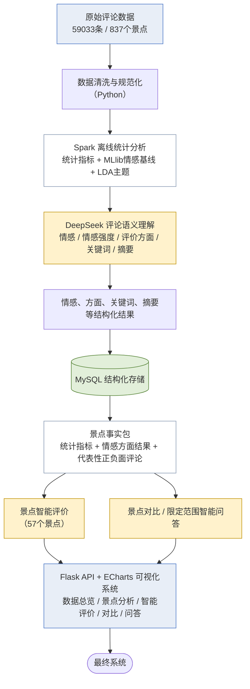

# 图1 系统总体流程图 · 绘图用文字模板

> 用途：粘贴到绘图网站（Mermaid Live Editor / draw.io / ProcessOn 等）生成图形后，替换开题报告中"图1"下方的文字版流程图。
> 与开题报告正文配套，节点名称、层次与报告中的描述保持一致，**改图时请同步检查报告正文的表述**。

---

## 方式一：Mermaid（可直接粘到 Mermaid Live Editor）



**配色建议（图例可省）**：黄色系＝DeepSeek 承担的语义理解与生成；白色系＝Spark／Python 计算的统计与事实；绿色＝数据存储；蓝色＝数据源与最终系统。

---

## 方式二：纯文本框图（用矩形/箭头符号直接画）

```
┌────────────────────────────────────────────┐
│        原始评论数据（59033条／837个景点）        │
└─────────────────────┬──────────────────────┘
                      ↓
┌────────────────────────────────────────────┐
│        数据清洗与规范化（Python）               │
└─────────────────────┬──────────────────────┘
                      ↓
┌────────────────────────────────────────────┐
│  Spark 离线统计分析                            │
│  统计指标 ＋ MLlib情感基线 ＋ LDA主题            │
└─────────────────────┬──────────────────────┘
                      ↓
┌────────────────────────────────────────────┐
│  DeepSeek 评论语义理解                         │
│  情感／情感强度／评价方面／关键词／摘要            │
└─────────────────────┬──────────────────────┘
                      ↓
┌────────────────────────────────────────────┐
│   情感、方面、关键词、摘要等结构化结果            │
└─────────────────────┬──────────────────────┘
                      ↓
┌────────────────────────────────────────────┐
│            MySQL 结构化存储                    │
└─────────────────────┬──────────────────────┘
                      ↓
┌────────────────────────────────────────────┐
│  景点事实包                                    │
│  统计指标＋情感方面结果＋代表性正负面评论          │
└──────────┬──────────────────────┬──────────┘
           ↓                      ↓
┌────────────────────┐  ┌────────────────────┐
│    景点智能评价       │  │  景点对比／智能问答   │
│    （57个景点）       │  │                    │
└──────────┬─────────┘  └─────────┬──────────┘
           └──────────┬───────────┘
                      ↓
┌────────────────────────────────────────────┐
│  Flask API ＋ ECharts 可视化系统               │
│  数据总览／景点分析／智能评价／对比／问答          │
└─────────────────────┬──────────────────────┘
                      ↓
┌────────────────────────────────────────────┐
│                 最终系统                      │
└────────────────────────────────────────────┘
```

---

## 方式三：节点与连线清单（用于 draw.io / ProcessOn 手工摆放）

**节点（自上而下 11 个）**

| # | 节点文字 | 建议形状 | 建议颜色 |
|---|---|---|---|
| 1 | 原始评论数据（59033条／837个景点） | 矩形／数据图形 | 蓝系 |
| 2 | 数据清洗与规范化（Python） | 矩形 | 白／灰 |
| 3 | Spark 离线统计分析（统计指标＋MLlib情感基线＋LDA主题） | 矩形 | 白／灰 |
| 4 | DeepSeek 评论语义理解（情感／情感强度／评价方面／关键词／摘要） | 矩形 | **黄系（突出）** |
| 5 | 情感、方面、关键词、摘要等结构化结果 | 矩形 | 白／灰 |
| 6 | MySQL 结构化存储 | 圆柱体（数据库） | 绿系 |
| 7 | 景点事实包（统计指标＋情感方面结果＋代表性正负面评论） | 矩形 | 白／灰 |
| 8 | 景点智能评价（57个景点） | 矩形 | **黄系（突出）** |
| 9 | 景点对比／限定范围智能问答 | 矩形 | **黄系（突出）** |
| 10 | Flask API＋ECharts 可视化系统（数据总览／景点分析／智能评价／对比／问答） | 矩形 | 蓝系 |
| 11 | 最终系统 | 圆角矩形／终止符 | 蓝系 |

**连线（10 条）**

1 → 2 → 3 → 4 → 5 → 6 → 7；7 分叉为 8 与 9；8、9 汇合到 10；10 → 11。

**图注（放在图下方）**：图1　系统总体流程图
**图下注解（建议保留）**：数据负责事实，DeepSeek 负责语义理解与自然语言解释。

---

## 绘图注意事项

1. **只画一条主线**，不要画成企业级微服务架构图；本图对应报告中"实施方案"一节的 8 个环节。
2. **突出 DeepSeek 的位置**：第 4、8、9 三个节点建议用同一强调色，使"评论语义理解 → 智能评价／对比／问答"这条 AI 主线一眼可见。
3. **不要把 Spark 与 DeepSeek 画成并列的重复环节**：Spark 出的是统计指标与基线，DeepSeek 出的是语义结果与自然语言内容，二者是上下游关系。
4. **分叉只画一处**（景点事实包之后），这与报告中"智能评价"与"对比／问答"共用一个事实来源的表述一致。
5. 出图后**请同步核对报告正文**：研究内容 5 个模块、实施方案 8 个环节、进度计划 8 个阶段、预期提交资料 9 项，均应能与本图对应。
